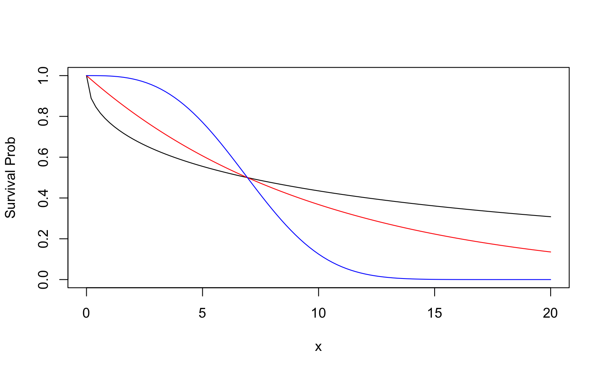
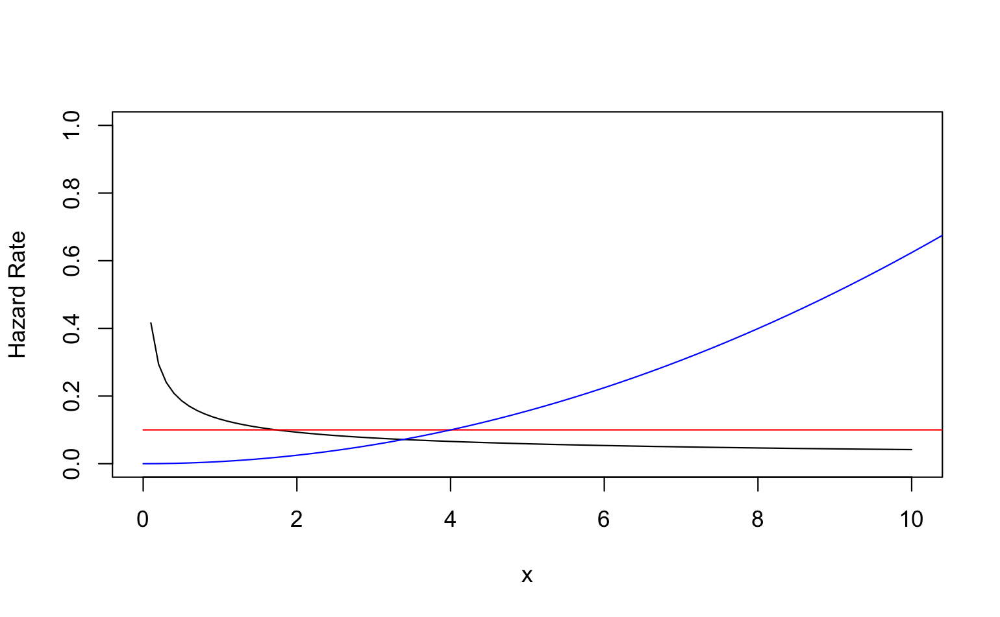

# 2. Basic Quantities and Models

Let $X$ be a nonnegative characterize variable from a homogeneous populaton. There are five functions characterize the distribution of $X$, say:

-   survival function $S(x)$
-   hazard rate/risk function $h(x)$
-   probability density function $f(x)$
-   mean residual life at time $x$ $mrl(x)$
-   cumulative hazard function $H(x)$

## Survival function {.unnumbered}

The probability of an individual surviving beyond time $x$ is defined as 

$$
S(x) = Pr(X > x) = 1- F(x) = \int_x^\infty f(t)dt 
$$ {#eq-2-2-1}

where $S(x)$ is referred to as the **survival function** or **reliability function**.

Therefore based on @eq-2-2-1,

$$
f(x) = -\frac{dS(x)}{dx}
$$ 

For discrete case 

$$
S(x) = Pr(X > x) = \sum_{x_j > x} p(x_j)
$$ 
where $p(x_j) = Pr(X = x_j)$ is the pmf.

### Example for Weibull distribution {.unnumbered}

$$
S(x) = \exp(-\lambda x^\alpha)
$$ 

When $\alpha = 1$, it becomes exponential distribution.

```{r fig2-1, eval = F}
f1 <- function(x) exp(-0.26328 * x^0.5)
f2 <- function(x) exp(-0.1 * x)
f3 <- function(x) exp(-0.00208 * x^3)
curve(f1, from = 0, to = 20, ylim = c(0, 1), ylab = "Survival Prob")
curve(f2, from = 0, to = 20, add = T, col = "red")
curve(f3, from = 0, to = 20, add = T, col = "blue")
```

{width="60%"}

## Hazard Function {.unnumbered}

Hazard function is also known as the conditional failure rate in reliability, the force of mortality in demography, the intensity function in stochastic processes, the age-specific failure rate in epidemiology, the inverse of the Mill's ratio in economics, or simply as the hazard rate.

$$
h(x)=\lim _{\Delta x \rightarrow 0} \frac{P[x \leq X<x+\Delta x \mid X \geq x]}{\Delta x}
$$ {#eq-2-3-1}

From @eq-2-3-1, $h(x)dx$ can be viewed as the "approximate" probability of an individual of age $x$ experiencing the event in the next instant.

If $X$ is continuous, then 
$$
h(x) = f(x)/S(x) = -\frac{d\ln S(x)}{dx}  
$$ {#eq-2-3-2}

In other word, 

$$
S(x) = \exp[-H(x)] = \exp[-\int_0^x h(u)du]   
$$ {#eq-2-3-4}

When $X$ is discrete, 

$$
h\left(x_j\right)=\operatorname{Pr}\left(X=x_j \mid X \geq x_j\right)=\frac{p\left(x_j\right)}{S\left(x_{j-1}\right)} = 1 - \frac{S\left(x_{j}\right)}{S\left(x_{j-1}\right)}, \quad j=1,2, \ldots
$$ 

The survival function can be written as the product of conditional survival probabilities: 

$$
S(x) = \prod_{x_j \leq x}S(x_j)/S(x_{j-1}) = \prod_{x_j \leq x}[1-h(x_j)]
$$

### Example for Weibull distribution {.unnumbered}

For Weibull distribution, the hazard function is 

$$
h(x) = \alpha\lambda x^{\alpha - 1}
$$

```{r fig2-2, eval = F}
curve(0.26328 * 0.5 * x^-0.5, from = 0, to = 10, ylim = c(0, 1), ylab = "Hazard Rate")
curve(0.1*x^0, from = 0, to = 20, add = T, col = "red")
curve(0.00208 * 3 * x^2, from = 0, to = 20, add = T, col = "blue")
```

{width="60%"}

## Cumulative hazard function {.unnumbered}

$$
H(x) = \int_0^x h(u)du = -\ln S(x)   
$$ {#eq-2-3-3}

For discrete $X$, 
$$
H(x) = \sum_{x_j \leq x} h(x_j)
$$ 
When $X$ is discrete, $S(x) = \exp[-H(x)]$ is no longer holds for true.

## Mean residual life function and median life {.unnumbered}

The parameter measures the expected remaining lifetime $mrl(x)$ is defined as

$$
mrl(x)  = E(X - x\mid X > x) = \frac{\int_x^\infty (t - x)f(t)dt}{S(x)} = \frac{\int_x^\infty S(t)dt}{S(x)} 
$$ {#eq-2-4-1}

Note:

> $$ \mu = E(X) = \int_0^\infty tf(t) dt = \int_0^\infty S(t) dt $$ $$ Var(X) = 2 \int_0^\infty tS(t) dt - [ \int_0^\infty S(t)dt]^2 $$

Examples:

-   The mean and median lifetimes for an exponential life distribution are $1/\lambda$ and $(\ln 2)/\lambda$.
-   The $100p$th percentile for the Weibull distribution is found by solving $1 - p = \exp\{-\lambda x_p^\alpha\}$ so $x_p = \{-\ln [1-p]/\lambda \}^{1/\alpha}$

## Common parametric models {.unnumbered}

| Distribution | $f(x)$                                                                                                  | $S(x)$                                        | $h(x)$                                                      | $E(X)$                                                                                           |
|---------------|:--------------|:--------------|:--------------|:--------------|
| Exponential  | $\lambda\exp(-\lambda x)$                                                                               | $\exp[-\lambda x]$                            | $\lambda$                                                   | $1/\lambda$                                                                                      |
| Weibull      | $\alpha\lambda x^{\alpha - 1}\exp(-\lambda x^\alpha)$                                                   | $\exp[-\lambda x^\alpha]$                     | $\alpha\lambda x^{\alpha - 1}$                              | $\frac{\Gamma(1 + 1/\alpha)}{\lambda^{1/\alpha}}$                                                |
| Gamma        | $\frac{\lambda^\beta x^{\beta - 1} \exp(-\lambda x)}{\Gamma(\beta)}$                                    | $1 - I(\lambda x, \beta)^*$                   | $\frac{f(x)}{S(x)}$                                         | $\beta/\lambda$                                                                                  |
| Log normal   | $\frac{\exp \left[-\frac{1}{2}\left(\frac{\ln x-\mu}{\sigma}\right)^2\right]}{x(2 \pi)^{1 / 2} \sigma}$ | $1 - \Phi(\frac{\ln x - \mu}{\sigma})$        | $\frac{f(x)}{S(x)}$                                         | $\exp(\mu + 0.5\sigma^2)$                                                                        |
| Log logistic | $\frac{\alpha x^{\alpha - 1} \lambda}{[1 + \lambda x^\alpha]^2}$                                        | $\frac{1}{1 + \lambda x^\alpha}$              | $\frac{\alpha x^{\alpha - 1}\lambda}{1 + \lambda x^\alpha}$ | $\frac{\pi \operatorname{Csc}(\pi / \alpha)}{\alpha \lambda^{1 / \alpha}} \text { if } \alpha>1$ |
| Gompertz     | $\theta e^{\alpha x} \exp [\frac{\theta}{\alpha}(1-e^{\alpha x})]$                                      | $\exp[\frac{\theta}{\alpha}(1-e^{\alpha x})]$ | $\theta e^{\alpha x}$                                       | $\int_0^\infty S(x) dx$                                                                          |
| Pareto       | $\frac{\theta \lambda^\theta}{x^{\theta + 1}}$                                                          | $\frac{\lambda^\theta}{x^\theta}$             | $\frac{\theta}{x}$                                          | $\frac{\theta\lambda}{\theta - 1}$ if $\theta > 1$                                               |

where $I(t, \beta) = \int_0^t u^{\beta - 1} \exp(-u) du/\Gamma(\beta)$
