## 1. Preliminaries

-   **Idempotent**: A matrix $A$ is idempotent if $AA = A$

    -   The rank of an idempotent matrix is equal to its trace, i.e. $rank(A) = trace(A)$

-   **Generalized Inverse**: $G$ is a generalized inverse of $A$ if $AGA = A$

-   Quadratic form, positive definite, non-negative definite

    -   $A$ is PD $\Rightarrow$ $A^{-1}$ exists

-   linear transformation

-   multivariate normal distribution

    -   if $y \sim N(\mu, \Sigma)$, then $y \stackrel{d}{=} Az + \mu$ where $z\sim N(0, I_{n\times n})$ and $A$ is an $m\times n$ matrix of rank $n$ such that $AA' = \Sigma$

    -   if $y\sim N(\mu, I_{n\times n})$, then $w = y'y \sim \chi_n^2(\mu'\mu/2)$

    -   Suppose $\Sigma$ is an $n\times n$ positive definite matrix, $A$ is an $n\times n$ symmetric matrix of rank $m$ such that $A\Sigma$ is *idempotent* ($A\Sigma A\Sigma = A\Sigma$). Then $$
        y \sim N(\mu, \Sigma) \Rightarrow y'Ay\sim \chi_m^2(\mu'A\mu/2)
        $$

    -   If $w\sim \chi_m^2(\theta)$ then $E(w) = m + 2\theta$ and $Var(w) = 2m + 8\theta$

-   **Non-central t distribution**: $y\sim N(\delta, 1)$, $w \sim \chi_m^2$, $y$ and $w$ are independent then $\frac{y}{\sqrt{w/m}}$ has a non-central $t$ distribution with $m$ degrees of freedom and non-centrality parameter $\delta$

-   **Non-central F distribution**: $w_1 \sim \chi_{m_1}^2(\theta)$ and $w_2\sim \chi_{m_2}^2$. $w_1$ and $w_2$ are independent then $\frac{w_1/m_1}{w_2/m_2}$ has a non-central F distribution with $m_1$ numerator degrees of freedom, $m_2$ denominator degrees of freedom and non-centrality parameter $\theta$: $\frac{w_1/m_1}{w_2/m_2} \sim F_{m_1, m_2}(\theta)$.

    -   if $u\sim t_m(\delta)$, then $u^2 \sim F_{1, m}(\delta^2/2)$.

## 2. Review of Linear Models

-   **General Linear Model (GLM)**: suppose $y = X\beta + \epsilon$ with $E(\epsilon) = 0$

    -   distribution of $y$ is left unspecified
    -   $E(y) \in \mathcal{C}(X)$

-   **Ordinary Least Squares Estimator (OLSE)**: $\hat y = P_X X = X(X'X)^-X'y$

-   **Orthogonal projection matrix** $P_X$:

    -   $P_X$ is symmetric, idempotent,
    -   $P_XX = X$ and $X'P_X = P_X$
    -   $rank(X)= rank(P_X) = tr(P_X)$
    -   other properties:
        -   $X'XA = X'XB \Leftrightarrow XA = XB$
        -   $\forall (X'X)^- \Rightarrow X(X'X)^-X'X = X$, $X'X(X'X)^-X' = X'$
        -   $A' = A$, $AGA = A \Rightarrow$ $AG'A = A$

-   **Estimable**: if $C$ is any $q\times p$ matrix, the linear function of $\beta$ given by $C\beta$ is estimable *if and only if* $C = AX$ for some matrix $q\times n$ matrix A

    -   OLSE of an estimable linear function $C\beta$ is $C(X'X)^-X'y$

-   **Normal equation**: $X'Xb = X'y$

    -   The OLSE of estimable $C\beta$ is $C\hat\beta$ where $\hat\beta$ is any solution for $b$ in the normal equations
    -   $\hat\beta = (X'X)^-X'y$ is always a solution to the Normal Equations for any $(X'X)^-$
    -   if $C\beta$ is estimable, then $C\hat\beta$ is the same for all solution $\hat\beta$ to the Normal equations and $C\hat\beta = AP_Xy$ where $C = AX$

-   **Gauss-Markov Model(GMM)**: suppose $y = X\beta + \epsilon$ with $E(\epsilon) = 0$ and $Var(\epsilon) = \sigma^2I$

-   **Gauss-Markov Theorem**: the OLSE of an estimable function $C\beta$ is the *BLUE* of $C\beta$

    -   an unbiased estimator of $\sigma^2$ under GMM is given by $\hat\sigma^2 = \frac{y'(I-P_X)y}{n-r}$

-   **Gauss-Markov Model with Normal Errors (GMMNE)**: suppose $y=X\beta+\epsilon$ with $\epsilon\sim N(0, \sigma^2I)$

    -   GMMNE is useful for drawing statistical inferences regrading estimable $C\beta$
    -   assume: 1. GMMNE 2. $C\beta$ is estimable 3. rand(C) = q and $d$ is a known $q\times 1$ vector. Then $H_0: C\beta = d$ is a *testable hypothesis*

-   $C\hat\beta\sim N(C\beta, \sigma^2C(X'X)^-C')$ and $\hat\sigma^2\sim \frac{\sigma^2}{n-r}\chi_{n-r}^2$ are independent

-   The F test statistic $$
    \begin{aligned}
    F & = (C\hat\beta-d)'[\widehat{Var}(C\hat\beta)]^{-1}(C\hat\beta - d)/q \\
      & = \frac{(C\hat\beta-d)'[C(X'X)^-C']^{-1}(C\hat\beta-d)/q}{\hat\sigma^2} \\
      & \sim F_{q, n-r}(\frac{(C\beta-d)'[C(X'X)^{-}C']^{-1}(C\beta-d)}{2\sigma^2})
    \end{aligned}
    $$ Under the null hypothesis $H_0: C\beta = d$, the non-negative non-centrality parameter is 0.

-   The t test statistic $$
    \begin{aligned}
    t &= \frac{c'\hat\beta-d}{\sqrt{\widehat{Var}(c'\beta)}} = \frac{c'\hat\beta-d}{\sqrt{\hat\sigma^2c'(X'X)^-c}} \\
      & \sim t_{n-r}(\frac{c'\beta-d}{\sqrt{\sigma^2c'(X'X)^-c}})
    \end{aligned}
    $$ Under the null hypothesis $H_0: C\beta = d$, the non-negative non-centrality parameter is 0.

## 3. The F test for Comparing Reduced vs. Full Models

-   Assume GMMNE and suppose $\mathcal{C}(X_0) \subset \mathcal{C}(X)$. We wish to test $H_0: E(y)\in C(X_0)$ vs. $H_A: E(y)\in C(X)\backslash C(X_0)$

    -   For the general case, consider the test statistics

    $$
    \begin{aligned}
    F & = \frac{y'(P_X-P_{X_0})y/[rank(X) - rank(X_0)]}{y'(I-P_X)y/[n-rank(X)]} \\
      & \sim F_{rank(X)-rank(X_0), n-rank(X)}\left(\frac{\beta
    X'(P_X-P_{X_0})X\beta}{2\sigma^2}\right)
    \end{aligned}
    $$

    -   Because $(\frac{P_X-P_{X_0}}{\sigma^2})(\sigma^2I) = P_X - P_X$ is idempotent and $rank(P_X - P_{X_0}) = rank(P_X)-rank(P_{X_0})$, $$
        y'(\frac{P_X-P_{X_0}}{\sigma^2})y \sim \chi_{rank(X)-rank(X_0)}^2(\frac{1}{2}\beta'X'(\frac{P_X-P_{X_0}}{\sigma^2})X\beta)
        $$

    -   $y'(\frac{I-P_X}{\sigma^2})y \sim \chi_{n-rank(X)}^2$

    -   $y'(\frac{P_X-P_{X_0}}{\sigma^2})y$ is independent of $y'(\frac{I-P_X}{\sigma^2})y$ because $(\frac{P_X-P_{X_0}}{\sigma^2})(\sigma^2I)(\frac{I-P_X}{\sigma^2}) = 0$

    -   If $H_0$ is true, then $(P_X-P_{X_0})X\beta = 0$

    -   $\beta'X(P_X-P_{X_0})X\beta = \|(P_X-P_{X_0})X\beta\|^2 = \|X\beta-P_{X_0}X\beta\|^2 = \|E(y) - P_{X_0}E(y)\|^2$

    -   $y'(P_X-P_{X_0})y = y'(I-P_{X_0})y - y'(I-P_X)y = SSE_{REDUCED} - SSE_{FULL}$

    -   Thus, $F = \frac{(SSE_{REDUCED} - SSE_{FULL})/(DFE_{REDUCED} - DEF_{FULL})}{SSE_{FULL}/DFE_{FULL}}$

    -   Equivalence of $F$ test: this reduced vs. full model F test is equivalent to the F test for testing $H_0: C\beta = d$ vs. $H_A: C\beta \neq d$.

## 4. Analysis of Two-Factor Experiments Based on Cell Means Models

-   **treatment**: a combination of one level from each factor forms a treatment
-   **full-factorial treatment design**: each possible combination of one level from each possible combination of one level from each factor is applied to at least one experimental unit
-   **completely randomized design (CRD)**: all possible balanced assignments to the treatment groups are equally likely
-   **cell mean model**: for $i = 1, 2$, $j = 1,2,3$ and $k = 1,2$, suppose $y_{ijk} = \mu_{ij} + \epsilon_{ijk}$
    -   $Y = X_{n\times p}\beta + \epsilon$
    -   each cell mean is estimable
    -   $\beta$ is estimable when $rank(X) = p$
    -   $\bar \mu_{.j} = \frac{1}{2}\sum_{i=1}^2 \mu_{ij}$, $\bar \mu_{i.} = \frac{1}{3}\sum_{j=1}^3 \mu_{ij}$ $\bar\mu_{..} = \frac{1}{6}\sum_{i=1}^2\sum_{j=1}^3 \mu_{ij}$
    -   **Least square means**: for example, the LSMEAN for $i = 1$ is $c'\hat\beta$ with $c' = [1/3, 1/3, 1/3, 0, 0, 0]$ and $\hat\beta = [\bar y_{11.}, \bar y_{12.}, \bar y_{13.}, \bar y_{21.}, \bar y_{22.}, \bar y_{23.}]'$. The standard error for an LSMEAN is given by $\sqrt{\widehat{Var}(c'\hat\beta)} = \sqrt{\hat\sigma^2c'(X'X)^-c}$.
-   **simple effect**: the difference between cell means that differ in level for only one factor
    -   for example, $\mu_{11} - \mu_{21}$
-   **main effect**: the difference between marginal means associated with two levels of a factor
    -   for example: $\bar \mu_{1.} - \bar \mu_{2.}$
    -   no main effect for $j$: $\bar \mu_{.1} = \bar \mu_{.2} = \bar \mu_{.3}$
-   **Interaction effect**: the linear combination $\mu_{ij} - \mu_{ij^*} - \mu_{i^*j}+\mu_{i^*j^*}$ for $i \neq i^*$ and $j \neq j^*$
    -   when there are no interactions between factors, the simple effects of either factor are the same across all levels of the other factor.
-   Test for non-zero effects: we can test whether simple effects, main effects or interaction effects are zero vs. non-zero using tests of the form $H_0: C\beta = 0$ vs. $H_A: C\beta \neq = 0$
-   An alternative parameterization of the cell mean model is $y_{ijk} = \mu + \alpha_i + \beta_j + \gamma_{ij} + \epsilon_{ijk}$.
    -   for example, $\mu_{11} = \mu + \alpha_1 + \beta_{1} + \gamma_{11}$, $\bar \mu_{1.} = \mu + \alpha_1 + \bar \beta_. + \bar \gamma_{1.}$
    -   simple effect $\mu_{11} - \mu_{12} = \alpha_1 - \alpha_2 + \gamma_{11} - \gamma_{21}$.
    -   main effect $\bar \mu_{1.} - \bar \mu_{2.} = \alpha_1 - \alpha_2 + \bar\gamma_{1.} - \bar\gamma_{2.}$
    -   interaction effect $\mu_{11}-\mu_{13}-\mu_{21}+\mu_{23} = \gamma_{11}-\gamma_{13}-\gamma_{21} + \gamma_{23}$
    -   The `lm` function in R uses a full-rank model matrix with $\beta = [\mu, \alpha_2, \beta_2, \beta_3, \gamma_{22}, \gamma_{23} ]'$
        -   $\mu = \mu_{11}$ , $\alpha = \mu_{21} - \mu_{11}$, $\beta_2 = \mu_{12} - \mu_{11}$, $\beta_3 = \mu_{13} - \mu_{11}$
        -   $\gamma_{22} = \mu_{11}+\mu_{22}-\mu_{21}-\mu_{12}$, $\gamma_{23} = \mu_{11}+\mu_{23} - \mu_{13} - \mu_{21}$

## 5. Analysis of Two-Factor Experiments Based on Additive Models

-   **additive model**: $y_{ijk} + \mu + \alpha_i + \beta_{j} + \epsilon_{ijk} \quad(i = 1,2; j = 1,2,3; k = 1,2)$, factors do not interact
    -   simple effect = main effect for additive model
    -   test for main effects: $\alpha_1 = \alpha_2$, $\beta_1 = \beta_2 = \beta_3$, no main effect for first level $\Leftrightarrow \alpha_2 = 0$, no main effect for second effect $\Leftrightarrow \beta_2 = \beta_3 = 0$

## 6. Analysis of Variance (ANOVA)

-   Notation: $y = X\beta + \epsilon$, $\epsilon \sim N(0, \sigma^2)$. Let $X_1 = 1$, $X_m = X$ and $X_{m+1} = I$. Suppose $C(X_1)\subset C(X_2) \cdots \subset C(X_{m-1}) \subset C(X_m)$. Let $P_j = P_{X_j}$ and $r_j = rank(X_j), \forall j = 1, \ldots, m+1$

    -   **Total sum of squares**: $SSTo = \sum_{i=1}^n (y_i - \bar y_.)^2 = y'(I-P_1)y = \sum_{j=1}^m y'(P_{j+1} - P_j)y$
    -   $SSE = y'(I- P_X)y$
    -   Sum of squares: $SS(2|1) = y'(P_2 - P_1)y, \ldots, SS(m|m-1) = y'(P_{m+1} - P_m)y$
    -   $rank(P_{j+1} - P_{j}) = tr(P_{j+1}) - tr(P_j) = r_{j+1} - r_j$
    -   zero cross-products: $(P_{j+1} - P_j)(P_{l+1} - P_{l}) = 0$
    -   because $(\frac{P_{j+1} - P_j}{\sigma^2})(\sigma^2I)$ is idempotent, $\frac{y'(P_{j+1}-P_j)y}{\sigma^2} \sim \chi_{r_{j+1}-r_j}^2\left(\frac{\beta'X'(P_{j+1}-P_j)X\beta}{2\sigma^2} \right)$ for all $j = 1, \ldots, m$
    -   **Mean squares**: $MS(j+1\mid j) = \frac{SS(j+1\mid j)}{r_{j+1}-r_j}$

-   **ANOVA F statistics**: $$
    F_j = \frac{MS(j+1\mid j)}{MSE} = \frac{y'(P_{j+1} - P_j)y)/(r_{j+1} - r_j)}{y'(I-P_X)y/(n-r)} \sim F_{r_{j+1} - r_j, n-r}\left( \frac{\beta'X'(P_{j+1} - P_{j})X\beta}{2\sigma^2}\right)
    $$

    -   $F_j$ can be used to test \$H\_{0j}:\frac{\beta'X'(P_{j+1} - P_{j})X\beta}{2\sigma^2} = 0 \$ vs. $H_{Aj}: \frac{\beta'X'(P_{j+1} - P_{j})X\beta}{2\sigma^2} \neq 0$
    -   $\frac{\beta'X'(P_{j+1} - P_{j})X\beta}{2\sigma^2}$ $\Leftrightarrow$ $(P_{j+1}-P_j)X\beta = 0$ $\Leftrightarrow$ $P_j E(y) = P_{j+1}E(y)$ $\Leftrightarrow$ $P_{j+1}E(y) \in C(X_j)$
    -   $C^*_j = P_{j+1} - P_j$ is not full rank so $(P_{j+1}-P_j)X\beta = 0$ is not a testable hypothesis. We can write $H_{0j}$ as a testable hypothesis by replacing $C^*_j$ with any matrix $C_j$ whose $q = r_{j+1} - r_j$ rows form a basis for the row space of $C^*_j$.

## 7. ANOVA for Balanced Two-Factor Experiments

-   a sequence of progressively more complex models:

    -   $E(y_{ijk}) = \mu$
    -   $E(y_{ijk}) = \mu + \alpha_i$
    -   $E(y_{ijk}) = \mu + \alpha_i + \beta_j$
    -   $E(y_{ijk}) = \mu + \alpha_i + \beta_j + \gamma_{ij}$

-   R code:

```{r eval = FALSE}
o = lm(y ~ diet + drug + diet:drug, data = data1)
anova(o)
```

## 8. ANOVA for Unbalanced Two-Factor Experiments

-   when data are unbalanced, the type 1 ANOVA test for two-way interactions is the same as the test for two-way interactions discussed previously. However, the type 1 ANOVA tests for individual factors are not the tests for main effects discussed previously. Furthermore, the type 1 results for individual factors depend on the order that the factors appear in the type 1 ANOVA table.

-   The test for main effects is based on LSMEANS (equal weighted), but Type 1 ANOVA test does not compute LSMEANS

-   Different types of Sums of Squares

    | Source   | Type I          | Type II         | Type III        |
    |----------|-----------------|-----------------|-----------------|
    | A        | SS(A\|1)        | SS(A\|1, B)     | SS(A\|1, B, AB) |
    | B        | SS(B\|1, A)     | SS(B\|1, A)     | SS(B\|1, A, AB) |
    | AB       | SS(AB\|1, A, B) | SS(AB\|1, A, B) | SS(AB\|1, A, B) |
    | Error    | SSE             | SSE             | SSE             |
    | C. Total | SSTotal         | ?               | ?               |

    -   For balanced data, Type I = Type II = Type III, The ANOVA F tests in the ANOVA table can be used to test for factor main effects and interaction
    -   For unbalanced data, Type I sums of squares always add to the total sum of squares, Type II and Type III sums of squares do not add to anything special when data are unbalanced. *The ANOVA F tests in the Type III ANOVA table can be used to test for factor main effects and interaction.*

-   How to fit the reduced model $A|1,B, AB$? Code like `lm(y~b+a:b)` or `model y = b a*b` does not fit the reduced model with no `a` main effect. Note $\bar \mu_{1.} = \bar \mu_{2.} \Leftrightarrow \mu_{22} = \mu_{11} + \mu_{12} - \mu_{21}$. So we can replace $\mu_{22}$ by three cell means.

-   Alternative Computation of Sums of Squares: Let $SS = y'(P_{X_{reduced+term}} - P_{X_{reduced}})y$ represent any Type I, II or III sum of squares. Let $q = rank(X_{reduced+term}) - rand(X_{reduced})$ be the degrees of freedom associated with $SS$. Let $C$ be any $q\times p$ matrix whose rows are a basis for the row space of $(P_{X_{reduced+term}} - P_{X_{reduced}})X$. Then the ANOVA F statistic $$
    \frac{SS/q}{MSE} = \frac{\hat\beta'C'[C(X'X)^-C']^{-1}C\hat\beta/q}{\hat\sigma^2}
    $$ Thus, any $SS$ can be computed as $\hat\beta'C'[C(X'X)^-C']^{-1}C\hat\beta$ for an appropriate matrix $C$.

## 9. Orthogonal Linear Combinations, Contrasts and Additional Partitioning of ANOVA Sums of Squares

-   Orthogonal: Under the model $y = X\beta + \epsilon, \epsilon \sim N(0, \sigma^2 I)$, two estimable linear combinations $c_1'\beta$ and $c_2'\beta$ are *orthogonal* if and only if their BLUEs $c_1'\hat\beta$ and $c_2'\hat\beta$ are uncorrelated.

    -   $cov(c_1'\hat\beta, c_2\hat\beta) = \sigma^2 c_1'(X'X)^- c_2$. Thus, estimable linear combinations $c_1'\beta$ and $c_2'\beta$ are orthogonal if and only if $c_1'(X'X)^-c_2 = 0$.

-   **Contrast**: A linear combinations $c'\beta$ is a *contrast* if and only if $c'1 = 0.$

-   **Orthogonal Contrast:** Two estimable contrasts $c'_1\beta$ and $c_2'\beta$ are orthogonal are called *orthogonal contrasts*.

Suppose $c_1'\beta, \ldots, c_q'\beta$ are pairwise orthogonal linear combinations. Let $C' = [c_1, \ldots, c_q].$ When $C$ has rank $q$, $\hat\beta'C'[C(X'X)^-C']^{-1}C\hat\beta = \sum_{i=1}^q (c_k'\hat\beta)^2/c_k'(X'X)^-c_k$.

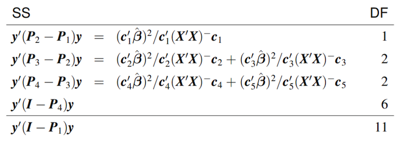

-   SAS code:

```{{sas}}
proc mixed;
	class diet drug;
	model weightgain=diet drug diet*drug;
	lsmeans diet*drug / slice=diet;
	estimate ’drug 1 - drug 2 for diet 1’  drug 1 -1 0 diet*drug 1 -1 0 0 0 0 / cl;
	estimate ’drug 1 - drug 3 for diet 1’  drug 1 0 -1 diet*drug 1 0 -1 0 0 0;
	estimate ’drug 2 - drug 3 for diet 1’  drug 0 1 -1 diet*drug 0 1 -1 0 0 0;
	estimate ’drug 1 - drug 2 for diet 2’  drug 1 -1 0 diet*drug 0 0 0 1 -1 0;
	estimate ’drug 1 - drug 3 for diet 2’  drug 1 0 -1 diet*drug 0 0 0 1 0 -1;
	estimate ’drug 2 - drug 3 for diet 2’  drug 0 1 -1 diet*drug 0 0 0 0 1 -1;
run;
```

-   Comments on the analysis
    -   Note that the main analysis focuses on pairwise comparisons of drugs within each diet.
    -   This involves a set of six contrasts, but the contrasts are not pairwise orthogonal within either diet.
    -   The sums of squares for these contrasts do not add up to any ANOVA sums of squares, but they are the contrasts that best address the researchers' questions.
    -   If we want to control the probability of one or more type I errors, we could use Bonferroni's method. In this case, the adjustment for multiple testing would not change the conclusions.

## 10. The Aitken Model

-   **Orthogonal Matrices:** A square matrix $P$ is said to be *orthogonal* if and only if $P'P = I$
-   **Spectral Decomposition Theorem:** An $n\times n$ symmetric matrix $H$ may be decomposed as $H = P\Lambda P' = \sum_{i=1}^n \lambda_i p_ip_i'$
    -   $P$ is an $n\times n$ orthogonal matrix whose columns $p_1,\ldots, p_n$ are the orthonormal eigenvectors of $H$
    -   $\Lambda = \text{diag}(\lambda_1, \ldots, \lambda_n)$ is a diagonal matrix whose diagonal entries are the eigenvalues of $H$
-   **Symmetric Square Root Matrix:** $H$ is an $n\times n$ symmetric, NND matrix. Then there exists a symmetric, NND matrix $B$ such that $BB = H$ where $B = P\Lambda^{1/2}P'$.
-   **Aitken Model:** $y = X\beta + \epsilon$, $E(\epsilon) = 0$, $Var(\epsilon) = \sigma^2 V$ where $V$ is a known positive definite variance matrix.
    -   $V^{-1/2}y = V^{-1/2}X\beta + V^{-1/2}\epsilon$
    -   With $z = V^{-1/2}y$, $W = V^{-1/2}X$ and $\delta = V^{-1/2}\epsilon$, we have $z = W\beta + \delta$, $E(\delta) = 0$ and $Var(\delta) = \sigma^2I$, which is a Gauss-Markov Model.
    -   $\hat z = V^{-1/2}X(X'V^{-1}X)^-X'V^{-1}y$ so that $\hat y = X(X'V^{-1}X)^-X'V^{-1}y$.
    -   If $C\beta$ is estimable, we know the BLUE is the OLS estimator. $C(W'W)^-W'z = C(X'V^{-1}X)^-X'V^{-1}y \equiv C\hat\beta_{V}$ is called a *Generalized Least Squares (GLS) estimator*.
    -   $\hat\beta_V = (X'V^{-1}X)^-X'V^{-1}y$ is a solution to the Aitken Equations: $X'V^{-1}X\beta = X'V^{-1}y$. When $V$ is diagonal, $\hat\beta_V$ is called *weighted least squares estimator*.
    -   An unbiased estimator of $\sigma^2$ is $$
        \frac{z'(I-P_W)z}{n - rank(W)} = \frac{\|(I- V^{-1/2}X(X'V^{-1}X)^-X'V^{-1/2})V^{-1/2}y\|^2}{n - rank(V^{-1/2}X)} = \frac{\|V^{-1/2}(y - X\hat\beta_V)\|^2}{n - r}
        $$

## 11. Linear Mixed-Effects Models

-   

    Mixed-effects model

    :   $y = X\beta + Zu + e$

    -   the elements of $\beta$ are considered to be non-random and are called *fixed effects*.
    -   the elements of $u$ are random variables and are called *random effects*.
    -   We assume that $E(e) = 0, Var(e) = R, E(u) = 0, Var(u) = G, Cov(u, e) = 0$
    -   $E(y) = X\beta$, $Var(y) = ZGZ' + R \equiv \Sigma$, $E(y\mid u) = X\beta + Zu$

When there are $m$ random factors, we can partition $Z$ and $u$ as $Z = [Z_1, \ldots, Z_m]$ and $u = [u_1', \ldots, u_m']'$ so that $Zu = \sum_{j = 1}^m Z_ju_j$.

-   We often assume that all random effects are mutually independent and random effects associated with $j$th random factor have variance $\sigma_j^2$. Then, $Var(y) = ZGZ' + R = \sum_{j=1}^R \sigma_j^2 Z_jZ_j' + \sigma_e^2I$.
-   The unknown variance parameters $\sigma_j^2, \sigma_e^2$ are called *variance components*.

Experimental Design Terminology

-   **Experiment**: An investigation in which the investigator applies some treatments to experimental units and then observes the effect of the treatments on the experimental units by measuring one or more response variables.
-   **Treatment**: a condition or set of conditions applied to experimental units in an experiment.
-   **Experimental Unit**: the physical entity to which a treatment is randomly assigned and independently applied.
-   **Response Variable**: a characteristic of an experimental unit that is measured after treatment and analyzed to assess the effects of treatments on experimental units.
-   **Observational Unit**: the unit on which a response variable is measured.
-   **Completely Randomized Design (CRD)** -- experimental design in which, for given number of experiment units per treatment, all possible assignments of treatments to experimental units are equally likely.
-   **Block** -- a group of experimental units that, **prior to treatment**, are expected to be more like one another (with respect to one or more response variables) than experimental units in general.
-   **Randomized Complete Block Design (RCBD)** -- experimental design in which separate and completely randomized treatment assignments are made for each of multiple blocks in such a way that all treatments have at least one experimental unit in each block.

Whenever an experiment involves multiple observations per experimental unit, it is important to include a random effect for each experimental unit.

Without a random effect for each experimental unit, a one-to-one correspondence between observations and experimental units is assumed.

## 12. The ANOVA Approach to the Analysis of Linear Mixed-Effects Models

Suppose $y_{ij} = \mu + \tau_i + u_{ij} + e_{ijk}$ , $i = 1, \ldots, t; j = 1, \ldots, n; k = 1, \ldots, m$ . $\beta = (\mu, \tau_1, \ldots, \tau_t)'$, $u = (u_{11}, u_{12}, \ldots, u_{tn})'$, $e = (e_{111}, e_{112}, \ldots, e_{tnm})'$.

$$ \begin{bmatrix}u \\ e \end{bmatrix} \sim N(\mathbf{0}, \begin{bmatrix} \sigma_u^2I & \mathbf{0} \\ \mathbf{0} & \sigma_e^2I \end{bmatrix}) $$

-   This is the standard model for a CRD with $t$ treatments, $n$ experimental units per treatment and $m$ observations per experimental unit.
-   We can write this model as $\mathbf{y} = \mathbf{X\beta} + \mathbf{Zu} + \mathbf{e}$ where $X = [\mathbf{1}*{tnm\times 1}, I*{t\times t} \otimes 1_{nm \times 1}]$ and $Z =[I_{tn\times tn} \otimes 1_{m\times 1}]$.
-   Let $X_1 = \mathbf{1}*{tnm\times 1}$, $X_2 = X$ and $X_3 = Z$. Note that $\mathcal{C}(X_1) \subset \mathcal{C}(X_2) \subset \mathcal{C}(X_3)$. Let $P_j = P*{X_j}$ for $j = 1, 2, 3$.

|                      |                      |
|:--------------------:|----------------------|
| 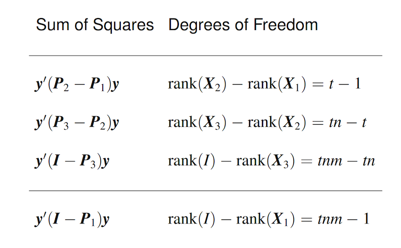 | 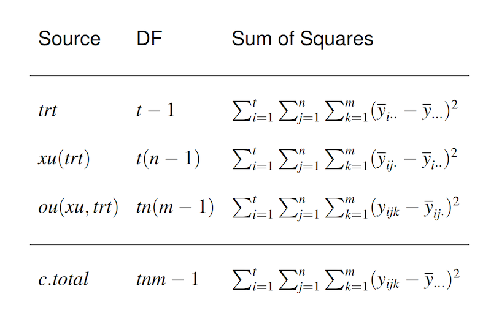 |
| 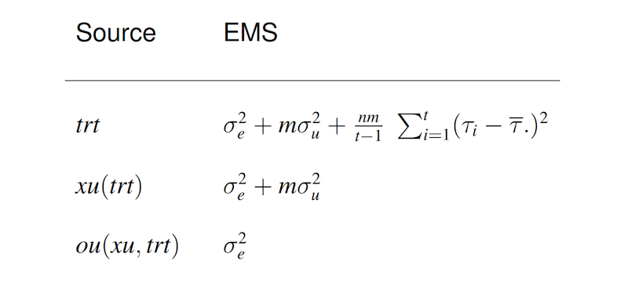 |                      |

-   Suppose $w_1, \ldots, w_k \stackrel{ind}{\sim} (\mu_w, \sigma_w^2)$, then $E\{\sum_{i = 1}^k (w_i - \bar w_.)^2\} = (k-1)\sigma_w^2.$

-   Expected value of $MS_{trt}$:

    $$ \begin{aligned}E\left(M S_{t r t}\right) &=\frac{n m}{t-1} \sum_{i=1}^{t} E\left(\bar{y}_{i . .}-\bar{y}_{\ldots} .\right)^{2} \\&=\frac{n m}{t-1} \sum_{i=1}^{t} E\left(\mu+\tau_{i}+\bar{u}_{i} .+\bar{e}_{i . .}-\mu-\bar{\tau} .-\bar{u} . .-\bar{e}_{. .}\right)^{2} \\&=\frac{n m}{t-1} \sum_{i=1}^{t} E\left(\tau_{i}-\bar{\tau} .+\bar{u}_{i}-\bar{u} . .+\bar{e}_{i . .}-\bar{e}_{. . .}\right)^{2} \\&=\frac{n m}{t-1} \sum_{i=1}^{t}\left[\left(\tau_{i}-\bar{\tau} .\right)^{2}+E\left(\bar{u}_{i .}-\bar{u} . .\right)^{2}+E\left(\bar{e}_{i . .}-\bar{e}_{i . .}\right)^{2}\right] \\&= \frac{n m}{t-1}\left[\sum_{i=1}^{t}\left(\tau_{i}-\bar{\tau} .\right)^{2}+E\left\{\sum_{i=1}^{t}\left(\bar{u}_{i .}-\bar{u} . .\right)^{2}\right\} + E\left\{\sum_{i=1}^{t}\left(\bar{e}_{i . .}-\bar{e} \ldots\right)^{2}\right\}\right]\\ & = \frac{nm}{t-1}\sum_{i = 1}^t (\tau_i - \bar\tau_.)^2 + m\sigma_u^2 + \sigma_e^2. \end{aligned}  $$

    where \$\bar{u}*{1.},* \ldots, \bar{u}{t.} \stackrel{i.i.d.}{\sim} N(0, \sigma*u\^2/n) \$ and \$\*\bar{e}{1..}, \ldots, \bar{e}\_{t..} \stackrel{i.i.d.}{\sim} N(0, \sigma\_e\^2/(nm)) \$ so that $E\left\{\sum_{i=1}^{t}\left(\bar{u}_{i .}-\bar{u} . .\right)^{2}\right\} = (t-1)\frac{\sigma_u^2}{n}$ and $E\left\{\sum_{i=1}^{t}\left(\bar{e}_{i . .}-\bar{e} \ldots\right)^{2}\right\} = (t-1)\frac{\sigma_e^2}{nm}$

-   Furthermore, it can be shown that $$
    \begin{aligned}\frac{\mathbf{y}^{\prime}\left(\mathbf{P}_{2}-\mathbf{P}_{1}\right) \mathbf{y}}{\sigma_{e}^{2}+m \sigma_{u}^{2}} & \sim \chi_{t-1}^{2}\left(\frac{n m}{2\left(\sigma_{e}^{2}+m \sigma_{u}^{2}\right)} \sum_{i=1}^{t}\left(\tau_{i}-\bar{\tau} .\right)^{2}\right) \\ \frac{\mathbf{y}^{\prime}\left(\mathbf{P}_{3}-\mathbf{P}_{2}\right) \mathbf{y}}{\sigma_{e}^{2}+m \sigma_{u}^{2}} & \sim \chi_{t n-t}^{2} \\\frac{\mathbf{y}^{\prime}\left(\mathbf{I}-\mathbf{P}_{3}\right) \mathbf{y}}{\sigma_{e}^{2}} & \sim \chi_{\operatorname{tnm}-t n}^{2}\end{aligned}
    $$

-   We can use $F_1$ to test $H_0: \tau_1 = \cdots = \tau_t$. and $F_2$ to test $H_0: \sigma_u^2 = 0$ $$
    \begin{aligned}F_{1} &=\frac{M S_{t r t}}{M S_{x u(t r t)}}=\frac{\mathbf{y}^{\prime}\left(\mathbf{P}_{2}-\mathbf{P}_{1}\right) \mathbf{y} /(t-1)}{\mathbf{y}^{\prime}\left(\mathbf{P}_{3}-\mathbf{P}_{2}\right) \mathbf{y} /(t n-t)} \\&=\frac{\left[\frac{y^{\prime}\left(\mathbf{P}_{2}-\mathbf{P}_{1}\right) \mathbf{y}}{\sigma_{e}^{2}+m \sigma_{u}^{2}}\right] /(t-1)}{\left[\frac{y^{\prime}\left(\mathbf{P}_{3}-\mathbf{P}_{2}\right) y}{\sigma_{e}^{2}+m \sigma_{u}^{2}}\right] /(t n-t)} \\& \sim F_{t-1, t n-t}\left(\frac{n m}{2\left(\sigma_{e}^{2}+m \sigma_{u}^{2}\right)} \sum_{i=1}^{t}\left(\tau_{i}-\bar{\tau}_{.}\right)^{2}\right)\end{aligned}
    $$

    $$
    \begin{aligned}F_{2} &=\frac{M S_{x u(t r t)}}{M S_{o u(x u, t r t)}}=\frac{\mathbf{y}^{\prime}\left(\mathbf{P}_{3}-\mathbf{P}_{2}\right) \mathbf{y} /(t n-t)}{\mathbf{y}^{\prime}\left(\mathbf{I}-\mathbf{P}_{3}\right) \mathbf{y} /(\operatorname{tnm}-t n)} \\&=\left(\frac{\sigma_{e}^{2}+m \sigma_{u}^{2}}{\sigma_{e}^{2}}\right) \frac{\left[\frac{\mathbf{y}^{\prime}\left(\mathbf{P}_{3}-\mathbf{P}_{2}\right) \mathbf{y}}{\sigma_{e}^{2}+m \sigma_{u}^{2}}\right] /(t n-t)}{\left[\frac{\mathbf{y}^{\prime}\left(\mathbf{I}-\mathbf{P}_{3}\right) \mathbf{y}}{\sigma_{e}^{2}}\right] /(t n m-t n)} \\& \sim\left(\frac{\sigma_{e}^{2}+m \sigma_{u}^{2}}{\sigma_{e}^{2}}\right) F_{t n-t, t n m-t n} .\end{aligned}
    $$

-   $(MS_{xu(trt)} - MS_{ou(xu, trt)})/m$ is an unbiased estimator of $\sigma_u^2.$ However, it can take negative values.

-   In this case, $\Sigma = \sigma_u^2 I_{tn\times tn} \otimes \mathbf{11}'*{m\times m} + \sigma_e^2 I*{tnm \times tnm}$ and $\hat\beta_\Sigma = (X'\Sigma^{-1}X)^{-1}X'\Sigma^{-1}y = (X'X)^-X'y = \hat\beta$, i.e. the GLS estimator is equal to the OLS estimator for any estimable $C\beta$.

    -   $C\beta$ can be written as $A[\bar{y}_{1..}, \ldots, \bar y_{t..}]'$. $Var(\bar y_{i..}) = Var(\bar u_{i.}) + Var(\bar e_{i..}) = \frac{1}{n}(\sigma_u^2 + \sigma_e^2/m)$ which implies the variance of the BLUE of $C\beta$ is $\sigma^2AA'/n$ where $\sigma^2 = \sigma_u^2 + \sigma_e^2/m$.

    -   We need to estimate $\sigma^2$ which can equivalently be estimated by $MS_{xu(trt)}/m$ or by the MSE in an analysis of the experimental unit means.

    -   For example, $\widehat{Var}(\bar y_{1..} - \bar y_{2..}) = \frac{2MS_{xu(trt)}}{nm}$ and a $100(1-\alpha)\%$ confidence interval for $\tau_1 - \tau_2$ is $\bar y_{1..} - \bar y_{2..} \pm t_{t(n-1), (1-\alpha)/2}\sqrt{\frac{2MS_{xu(trt)}}{nm}}$.

    -   A test of $H_0: \tau_1 = \tau_2$ is based on

        $$ t = \frac{\bar y_{1..} - \bar y_{2..}}{\sqrt{\frac{2MS_{xu(trt)}}{nm}}} \sim t_{t(n-1)}\left(\frac{\tau_1 - \tau_2}{\frac{2(\sigma_e^2 + m\sigma_u^2)}{nm}}\right).
         $$

## 13. The Cochran-Satterthwaite Approximation for Linear Combination of Mean Squares

Suppose $M_1, \ldots, M_k$ are independent mean squares and that $d_iM_i/E(M_i)\sim \chi_{d_i}^2$ for $i = 1,\ldots, k$ . That is, $M_i \sim \frac{E(M_i)}{d_i} \chi_{d_i}^2$. Consider $M = a_1M_1 + \ldots + a_kM_k.$ The **Cochran-Satterthwaite approximation** works by assuming that $M$ is approximately distributed as a scaled $\chi^2$, $\frac{dM}{E(M)} \sim \chi_d^2 \Leftrightarrow M \sim \frac{E(M)}{d} \chi_d^2$.

-   If $M \sim \frac{E(M)}{d} \chi_d^2$, then $Var(M) \approx (\frac{E(M)}{d})^2Var(\chi_d^2) \approx \frac{2M^2}{d}$
-   Note that $Var(M) = \sum_{i=1}^k 2a_i^2[E(M_i)]^2/d_i \approx 2\sum_{i=1}^k a_i^2M_i^2/d_i$

Therefore, $$
\begin{aligned}d = \frac{M^2}{\sum_{i=1}^k a_i^2M_i^2/d_i} = \frac{(\sum_{i=1}^k a_iM_i)^2}{\sum_{i=1}^k a_i^2 M_i^2/d_i}\end{aligned}
$$

## 14. Linear Mixed-Effects Models for Data from Split-Plot Experiments

An example Split-Plot Experiment

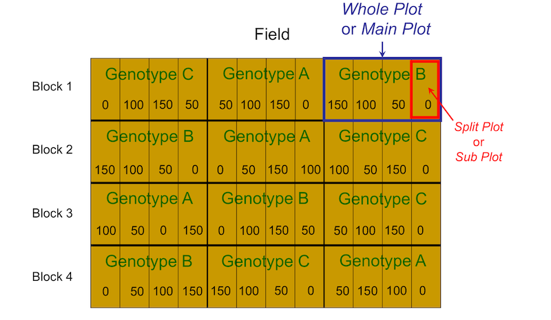

-   this experiment has two factors: genotype and fertilizer
-   genotype is caller the *whole-plot* *factor* because its levels are randomly assigned to whole plots
-   fertilizer is called the *split-plot* *factor* because its levels are randomly assigned to split plots within each whole plot
-   we have two different sizes of experimental units: whole plots are the *whole-plot experimental units* and split-plots are the *split-plot experimental units*

|                      |                      |
|:--------------------:|----------------------|
| 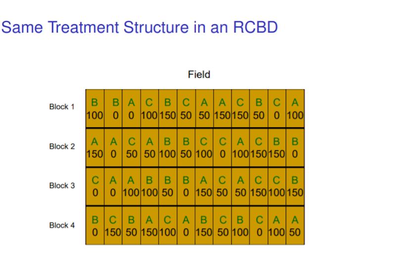 | 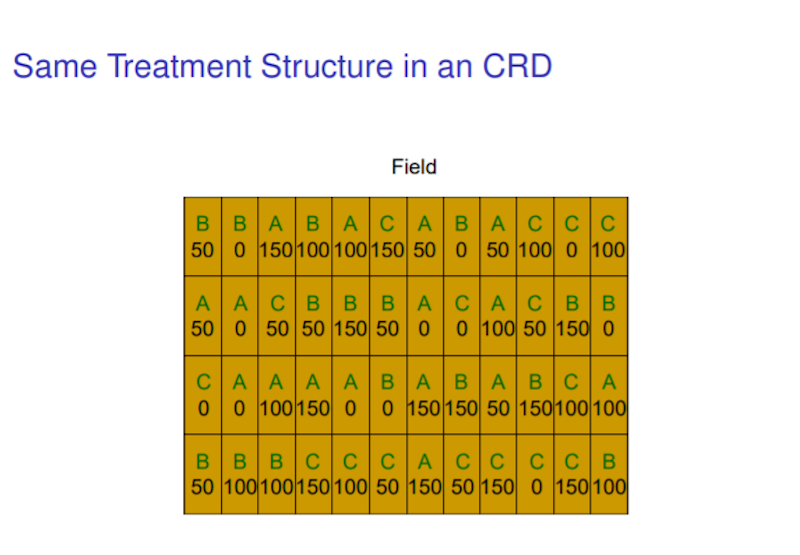 |

Why Use a Split-Plot Design?

-   Split-plot designs usually arise because **logistical constraints** make a CRD or RCBD impractical.
-   For example, it may be easier to change from one fertilizer level to another as a tractor drives through a field, while it may be **more difficult to change from planting one genotype to planting another**.
-   In the engineering literature, split-plot designs are sometimes called **designs with hard-to-change factors**.

Another split-plot experimental design:

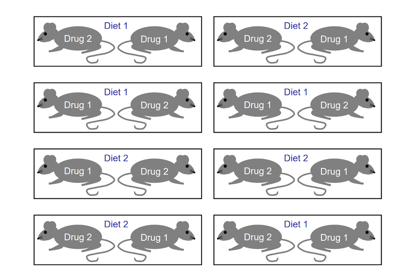

-   Diet is the whole-plot treatment factor.
-   Litters are the whole-plot experiment units.
-   Drug is the split-plot treatment factor.
-   Mice are the split-plot experiment units.

## 15. ANOVA for Balanced Split-Plot Experiments


Model: $y_{ijk} = \mu_{ij} + b_k + w_{ik} + e_{ijk}$, Genotype $i = 1, 2, 3$, Fertilizer $j = 1,2, 3,4$, Block $k = 1, 2, 3, 4$.

-   Because the experiment is balanced, the GLS estimator is equal to the OLS estimator for any estimable $C\beta$: $C\hat\beta_\Sigma = C\hat \beta$.

|                      |                      |
|----------------------|----------------------|
| 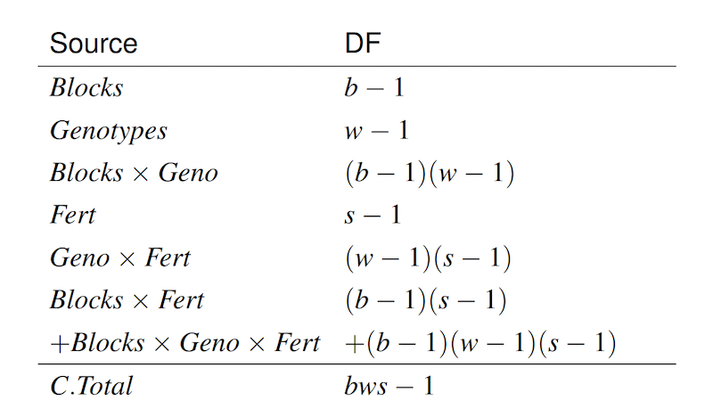 | 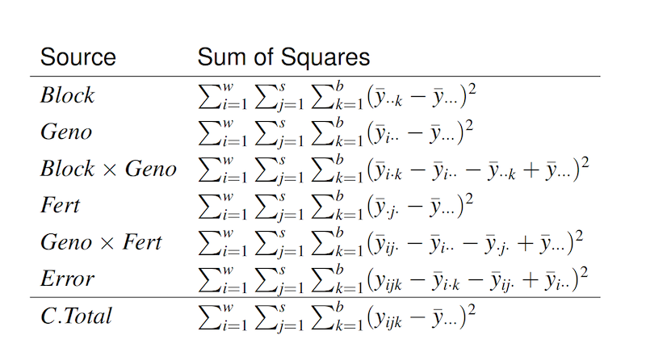 |
| 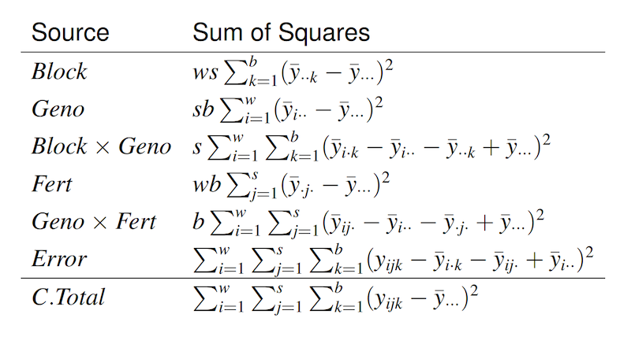 | 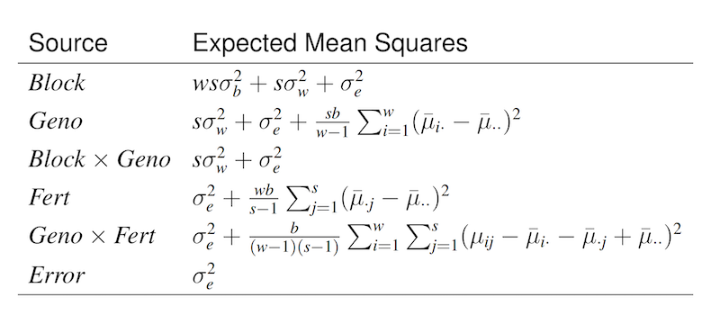 |

-   there are no terms in our model corresponding to $Block\times Fert$.

-   $E(MS_{Blocks\times Fert}) = E(MS_{Blocks\times Geno\times Fert}) = \sigma_e^2$.

    $$\begin{aligned}&E\left(M S_{\text {Geno }}\right)=\frac{s b}{w-1} \sum_{i=1}^{w} E\left(\bar{y}_{i . .}-\bar{y} \ldots\right)^{2} \\&\quad=\frac{s b}{w-1} \sum_{i=1}^{w} E\left(\bar{\mu}_{i}-\bar{\mu} . .+\bar{w}_{i}-\bar{w} . .+\bar{e}_{i .}-\bar{e} \ldots\right)^{2} \\&=s b\left\{\frac{\sum_{i=1}^{w}\left(\bar{\mu}_{i}-\bar{\mu} . .\right)^{2}}{w-1}+E\left[\frac{\sum_{i=1}^{w}\left(\bar{w}_{i}-\bar{w} . .\right)^{2}}{w-1}\right]+E\left[\frac{\sum_{i=1}^{w}\left(\bar{e}_{i . .}-\bar{e}_{\ldots} . .\right)^{2}}{w-1}\right]\right\} \\&=s b \frac{\sum_{i=1}^{w}\left(\bar{\mu}_{i}-\bar{\mu} . .\right)^{2}}{w-1}+s b \frac{\sigma_{w}^{2}}{b}+s b \frac{\sigma_{e}^{2}}{s b} \\&=s b \frac{\sum_{i=1}^{w}\left(\bar{\mu}_{i}-\bar{\mu} .\right)^{2}}{w-1}+s \sigma_{w}^{2}+\sigma_{e}^{2}\end{aligned}$$

    $$\begin{aligned}&E\left(M S_{\text {Block } \times \text { Geno }}\right)=\frac{s}{(w-1)(b-1)} \sum_{i=1}^{w} \sum_{k=1}^{b} E\left(\bar{y}_{i \cdot k}-\bar{y}_{i . .}-\bar{y}_{\cdot \cdot k}+\bar{y} \ldots\right)^{2} \\&=\frac{s}{(w-1)(b-1)} \sum_{i=1}^{w} \sum_{k=1}^{b} E\left(w_{i k}-\bar{w}_{i .}-\bar{w}_{\cdot k}+\bar{w}_{. .}+\bar{e}_{i \cdot k}-\bar{e}_{i . .}-\bar{e}_{. . k}+\bar{e}_{\ldots}\right)^{2} \\&=\frac{s}{(w-1)(b-1)} E\left[\sum_{i=1}^{w} \sum_{k=1}^{b}\left(w_{i k}-\bar{w}_{i} .\right)^{2}-2 \sum_{i=1}^{w} \sum_{k=1}^{b}\left(w_{i k}-\bar{w}_{i}\right)\left(\bar{w}_{\cdot k}-\bar{w} . .\right)\right. \\&\left.+\sum_{i=1}^{w} \sum_{k=1}^{b}\left(\bar{w}_{\cdot k}-\bar{w} . .\right)^{2}+e^{2} \text { sum }\right] \\&=\frac{s}{(w-1)(b-1)} E\left[\sum_{i=1}^{w} \sum_{k=1}^{b}\left(w_{i k}-\bar{w}_{i} .\right)^{2}-w \sum_{k=1}^{b}\left(\bar{w}_{\cdot k}-\bar{w} . .\right)^{2}+e^{2} \mathrm{sum}\right] \\&=\frac{s}{(w-1)(b-1)}\left[w(b-1) \sigma_{w}^{2}-w(b-1) \sigma_{w}^{2} / w+E\left(e^{2} \text { sum }\right)\right]\\ & = s\sigma_w^2 + \sigma_e^2\end{aligned}$$

    where

    $$ \begin{aligned}E\left(e^{2} \mathrm{sum}\right) &=E\left[\sum_{i=1}^{w} \sum_{k=1}^{b}\left(\bar{e}_{i \cdot k}-\bar{e}_{i .}-\bar{e}_{. . k}+\bar{e} \ldots\right)^{2}\right] \\&=\frac{(w-1)(b-1)}{s} \sigma_{e}^{2}\end{aligned}$$

### 15.1. Inference for Whole-Plot

-   **Test for whole-plot factor main effects:**

    $$ H_0: \bar \mu_{1.} = \ldots = \bar\mu_{w.} \Leftrightarrow H_0: \frac{sb}{w-1}\sum_{i=1}^w (\bar \mu_{i.} - \bar \mu_{..})^2 = 0 $$

    We compare $\frac{MS_{Geno}}{MS_{Block\times Geno}}$ to a central F-test with $w- 1$ and $(w-1)(b-1)$ degrees of freedom.

-   **Comparison for whole-plot marginal means:**

    $$ H_0: \bar \mu_{1.} = \bar \mu_{2.} $$

    Note that $$
    \begin{aligned}\operatorname{Var}\left(\bar{y}_{1 . .}-\bar{y}_{2 . .}\right) &=\operatorname{Var}\left(\bar{\mu}_{1.}-\bar{\mu}_{2 .}+\bar{w}_{1.}-\bar{w}_{2 .}+\bar{e}_{1 . .}-\bar{e}_{2 \cdot .}\right) \\&=\frac{2 \sigma_{w}^{2}}{b}+\frac{2 \sigma_{e}^{2}}{s b} \\&=\frac{2}{s b}\left(s \sigma_{w}^{2}+\sigma_{e}^{2}\right)=\frac{2}{s b} E\left(M S_{B l o c k \times \text { Geno }}\right) \end{aligned}
    $$

    so that $\widehat{\operatorname{Var}}\left(\bar{y}_{1..}-\bar{y}_{2..}\right)=\frac{2}{s b} M S_{B l o c k \times G e n o}$. We can use $$
    t=\frac{\bar{y}_{1..}-\bar{y}_{2 ..}-\left(\bar{\mu}_{1.}-\bar{\mu}_{2.}\right)}{\sqrt{\frac{2}{s b} M S_{\text {Block } \times \text { Geno }}}} \sim t_{(w-1)(b-1)}
    $$

    to test $H_0$.

-   **Multiple test for whole-plot marginal means:** $$
    H_{0}: \boldsymbol{C}\left[\begin{array}{c}\bar{\mu}_{1.} \\\vdots \\\bar{\mu}_{w.}\end{array}\right]=\mathbf{0}, 
    $$

we can use an F statistics with $q$ and $(w-1)(b-1)$ degrees of freedom: $$
F=\frac{\left(\boldsymbol{C}\left[\begin{array}{c}\bar{y}_{1..} \\\vdots \\\bar{y}_{w..}\end{array}\right]\right)^{\prime}\left[\frac{M S_{\text {Block } \times \text{Gen}}}{s b} \boldsymbol{C} \boldsymbol{C}^{\prime}\right]^{-1}\left(\boldsymbol{C}\left[\begin{array}{c}\bar{y}_{1..} \\\vdots \\\bar{y}_{w..}\end{array}\right]\right)}{q}
$$

## 16. SAS Analysis of Split-Plot Experiments

#### 16.1 Read Data {.unnumbered}

```{{SAS}}
proc import datafile=’C:\\Data\\FieldSplitPlotData.txt’
  dbms=TAB replace out=Field;
run;
proc print data=Field (obs=14);
run;
```

#### 16.2 Fit Linear Mixed-Effects Model

```{{SAS}}
proc mixed data=Field;
 class block geno fert;
 model y=geno fert geno*fert / ddfm=satterthwaite;
 random block block*geno;
```

#### 16.3 Example Estimate Stateements

```{{SAS}}
estimate ’geno 1’
  intercept 4 geno 4 0 0 fert 1 1 1 1
  geno*fert 1 1 1 1 0 0 0 0 0 0 0 0 / divisor=4 cl;

estimate ’geno 1 - geno 2’
  geno 4 -4 0
  geno*fert 1 1 1 1 -1 -1 -1 -1 0 0 0 0 / divisor=4 cl;

estimate ’geno 1 - geno 2 with no fertilizer’
  geno 1 -1 0 geno*fert 1 0 0 0 -1 0 0 0 0 0 0 0 / cl;
run;
```

#### 16.4 Refit model with Fixed Block Effects

```{{SAS}}
proc mixed data=Field;
  class block geno fert;
  model y=block geno fert geno*fert / ddfm=satterthwaite;
random block*geno;
```

## 17. R Analysis of Split-Plot Experiments

```{r, eval = FALSE}
library(lme4)
library(lmerTest)

fd = read.delim("<https://dnett.github.io/S510/FieldSplitPlotData.txt>")
y = fd$y
b = factor(fd$block)
g = factor(fd$geno)
f = factor(fd$fert/50 + 1) 

o = lmer(y ~ g + f + g:f + (1|b) + (1|b:g))
summary(o) 
anova(o)

ls_means(o)

betahat=fixef(o)
betahat

#Coefficients for geno 1 marginal mean
C1 = matrix(c(1, 0, 0, 1/4, 1/4, 1/4, 0, 0, 0, 0, 0, 0), nrow = 1)
#Coefficients for geno 1 - geno 2 marginal mean
C2 = matrix(c(0, -1, 0, 0, 0, 0, -1/4, 0, -1/4, 0, -1/4, 0), nrow = 1)
#Coefficients for geno 1 - geno 2 with no fertilizer
C3 = matrix(c(0, -1, 0, 0, 0, 0, 0, 0, 0, 0, 0, 0), nrow = 1)

C = rbind(C1, C2, C3)
contest(o, L = C, joint = F, confint = T)

a = anova(lm(y ˜ b + g + b:g + f + g:f))
a

MSbg = a[4,3]
MSe = a[6,3]
# an unbiased estimator of variance for the whole-plot random effects
(MSbg - MSe) / 4 
MSg = a[2,3]
# The correct F statistic for testing for genotype main effects
MSg / MSbg

d = aggregate(y, by = list(b, g), FUN = mean)

anova(lm(wpaverage ˜ block + geno, data = d))
```

## 18. More Example Split-Plot Experiments

##### Example 1: {.unnumbered}

Researchers were interested in studying how soil moisture level affects the ability of plants to respond to a virus infection. A total of 30 pots were assigned to three watering levels (1 = low, 2 = medium, 3 = high) using a balanced and completely randomized design. Each of the 30 pots contained four seedlings. Two randomly selected seedlings within each pot were injected with a virus. The remaining two seedlings in each pot were "mock infected" by injection with a harmless substance. Two weeks after treatment, each seedling was individually weighed, and these weights served as the response variable for subsequent analysis.

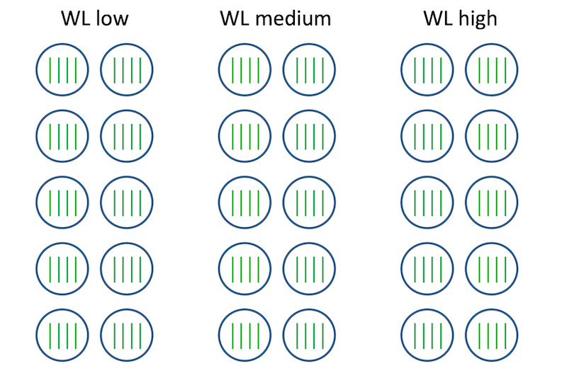

-   Notation:

    -   $i = 1, 2, 3$: watering levels
    -   $j = 1, \ldots, 10$: pots within each watering levels
    -   $k = 1, 2$ : infections (control, virus)
    -   $l = 1, 2$: seedlings within watering level, pot, and infection

-   Model: $$
    y_{ijkl} = \mu_{ik} + p_{ij} + e_{ijkl}
    $$ where $p_{ij} \sim N(0, \sigma_p^2)$, $e_{ijkl} \sim N(0, \sigma_e^2)$.

-   ANOVA Table:

    |     Source     | DF  |
    |:--------------:|:---:|
    |       wl       |  2  |
    |    pot(wl)     | 27  |
    |      inf       |  1  |
    | wl$\times$ inf |  2  |
    |     error      | 87  |
    |    c.total     | 119 |

-   SAS Code

``` sas
  proc mixed; 
    class wl pot inf; 
    model y = wl inf wl*inf / ddfm = satterth; 
    random pot(wl); 
  run; 
```

##### Example 2: {.unnumbered}

Researchers were interested in studying how soil moisture level affects the ability of plants to respond to a virus infection. A total of 30 trays were assigned to three watering levels (1 = low, 2 = medium, 3 = high) using a balanced and completely randomized design. Each of the 30 trays contained two pots. Each of the 60 pots contained two seedlings. The two seedlings in one randomly selected pot in each tray were injected with a virus. The two seedlings in the other pot on a given tray were "mock infected" by injection with a harmless substance. Two weeks after treatment, each seedling was individually weighed, and these weights served as the response variable for subsequent analysis.

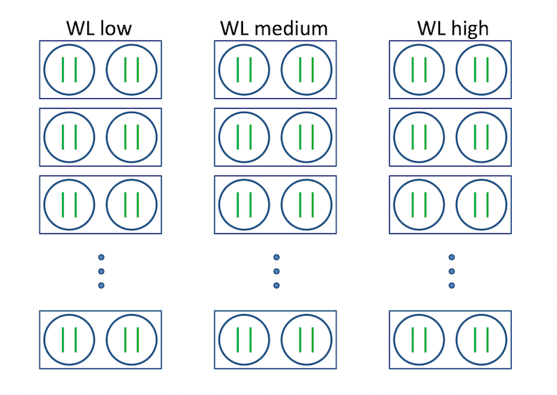

-   Notation:

    -   $i = 1, 2, 3$: watering levels
    -   $j = 1, \ldots, 10$: trays within each watering level
    -   $k = 1, 2$ : infections (control, virus)
    -   $l = 1, 2$: seedlings within watering level, pot, and infection

-   Model: $$
    y_{ijkl} = \mu_{ik} + t_{ij} +  p_{ijk} + e_{ijkl}
    $$ where $t_{ij} \sim N(0, \sigma_t^2)$, $p_{ijk} \sim N(0, \sigma_p^2)$, $e_{ijkl} \sim N(0, \sigma_e^2)$.

-   ANOVA Table

    |       Source        | DF  |
    |:-------------------:|:---:|
    |         wl          |  2  |
    |      tray(wl)       | 27  |
    |         inf         |  1  |
    |   wl$\times$ inf    |  2  |
    | inf$\times$tray(wl) | 27  |
    |        error        | 60  |
    |       c.total       | 119 |

-   SAS Code

``` sas
  proc mixed; 
    class wl tray inf; 
    model y = wl inf wl*inf/ ddfm = satterth; 
    random tray(wl) inf*tray(wl); 
  run; 
```

##### Example 3: {.unnumbered}

Researchers were interested in studying how soil moisture level affects the ability of plants to respond to a virus infection. A total of 30 trays were assigned to three watering levels (1 = low, 2 = medium, 3 = high) using a balanced and completely randomized design. Each of the 30 trays contained two pots. Each of the 60 pots contained two seedlings. In each pot, one of the two seedlings was randomly selected and injected with a virus; the other seedling in the pot was "mock infected" by injection with a harmless substance. Two weeks after treatment, each seedling was individually weighed, and these weights served as the response variable for subsequent analysis.

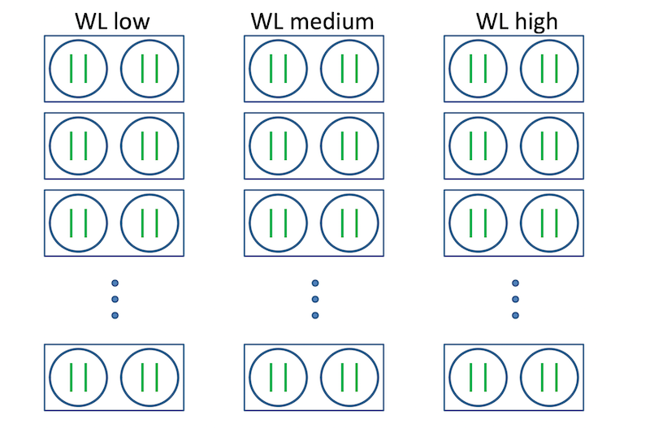 \* Notation:

-   $i = 1, 2, 3$: watering levels

-   $j = 1, \ldots, 10$: trays within each watering level

-   $k = 1, 2$ : pots within watering levels and trays

-   $l = 1, 2$: infections (control, virus)

-   Model $$
    y_{ijkl} = \mu_{ik} + t_{ij} +  p_{ijk} + e_{ijkl}
    $$

-   ANOVA Table

    |    Source     | DF  |
    |:-------------:|:---:|
    |      wl       |  2  |
    |   tray(wl)    | 27  |
    | pot(wl tray)  | 30  |
    |      inf      |  1  |
    | wl$\times$inf |  2  |
    |     error     | 57  |
    |    c.total    | 119 |

-   SAS Code

``` sas
  proc mixed; 
    class wl tray pot inf; 
    model y = wl inf wl*inf / ddfm = satterth;
    random tray(wl) pot(wl tray); 
  run; 
```

##### Example 4: {.unnumbered}

Researchers were interested in determining which combination of cake recipe and frosting recipe would yield the best tasting frosted cake. Two cake recipes (labeled CR1 and CR2) and two frosting recipes (labeled FR1 and FR2) were considered. The two cake recipes were randomly assigned to four bakers with two bakers for each cake recipe. Each baker prepared and baked a cake according to the recipe he or she was assigned. While cakes were baking and cooling, each baker prepared one batch of frosting using each of the frosting recipes. Half of each cake was randomly selected and covered with frosting prepared using FR1. The other half of each cake was covered with frosting prepared using FR2.

Two pieces of frosted cake from each half of each cake were scored for taste, with higher scores indicating better tasting frosted cake. The following diagram shows the four cakes baked by the four bakers as large rectangles. The dashed line on each rectangle shows the dividing point that separates FR1 frosting from FR2 frosting. The numbered squares within each rectangle show the pieces of frosted cake that were scored for taste.

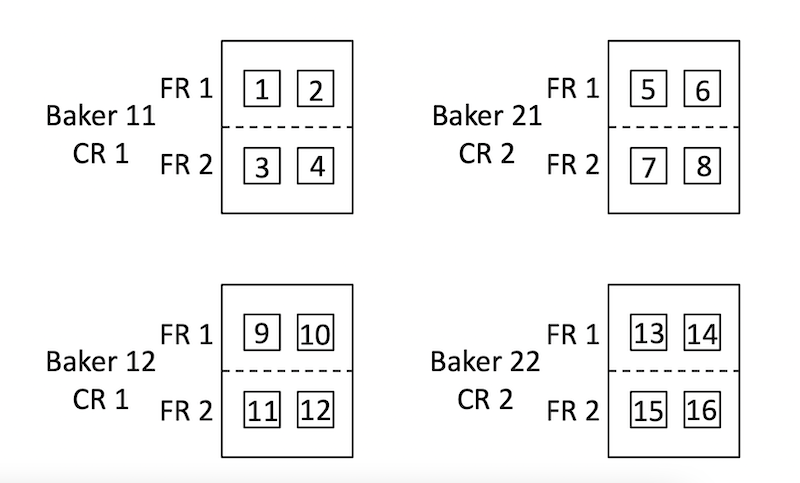

-   Notation:

    -   $i = 1, 2$: cake recipes
    -   $j = 1, 2$: bakers within each cake recipe
    -   $k = 1, 2$ : frosting recipes
    -   $l = 1, 2$: pieces of cake within each half cake

-   Model $$
    y_{ijkl} = \mu_{ik} + b_{ij} + h_{ijk} + e_{ijkl}
    $$ where $b_{11}, b_{12}, b_{21}, b_{22} \sim N(0, \sigma_{b}^2)$, $h_{111}, \ldots, h_{222} \sim N(0, \sigma_h^2)$, $e_{ijkl} \sim N(0, \sigma_e^2)$.

-   SAS Code

``` sas
  proc mixed;
    class cr baker fr;
    model y=cr fr cr*fr / ddfm=satterth;
    random baker(cr) fr*baker(cr);
  run;
```

-   ANOVA Table

    |            Source            | DF  |
    |:----------------------------:|-----|
    |              cr              | 1   |
    | baker(cr) = whole plot error | 2   |
    |              fr              | 1   |
    |         cr$\times$fr         | 1   |
    |     fr$\times$baker(fr)      | 2   |
    | error = piece(cr, baker, fr) | 8   |
    |           c.total            | 15  |

##### Example 5: {.unnumbered}

In the context of the frosted cake example (Example 4), a statistician is asked to analyze the data. The statistician asks, "How was the score for each piece of cake determined?"

> **Answer**: Two pieces of frosted cake from each half of each cake were cut and delivered to eight trained judges for evaluation. Each judge tasted and separately assigned a score to two pieces of frosted cake. In the following diagram, the numbers 1 through 8 indicate the pieces of cake scored by judges 1 through 8, respectively.

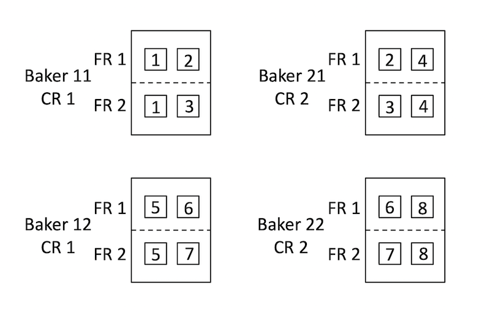

-   Notation:

    -   $i = 1, 2$: cake recipes
    -   $j = 1, 2$: bakers within each cake recipe
    -   $k = 1, 2$ : frosting recipes
    -   $l = 1, 2$: pieces of cake within each half cake

-   Model $$
    y_{ijkl} = \mu_{ik} + b_{ij} + h_{ijk} + t_l + e_{ijkl}
    $$ where $b_{11}, b_{12}, b_{21}, b_{22} \sim N(0, \sigma_{b}^2)$, $h_{111}, \ldots, h_{222} \sim N(0, \sigma_h^2)$, $t_1, \ldots, t_8 \sim N(0, \sigma_t^2)$, $e_{ijkl} \sim N(0, \sigma_e^2)$.

-   SAS Code

    ``` sas
    proc mixed;
      class cr baker fr judge;
      model y=cr fr cr*fr / ddfm=satterth;
      random baker(cr) fr*baker(cr) judge;
      lsmeans cr fr cr*fr;
      estimate ...
    run;
    ```

-   R Code

    ``` r
    library(lme4)
    library(lmerTest)
    o = lmer(y ˜ cr + fr + cr:fr + (1 | baker) + (1 | baker:fr) + (1 | judge))
    # cr %in% 1:2, fr %in% 1:2, baker %in% 1:4, judge %in% 1:8
    anova(o)
    ls_means(o)
    contest(...)
    ```

-   ANOVA Table

    |       Source        | DF  |
    |:-------------------:|:---:|
    |         cr          |  1  |
    |      baker(cr)      |  2  |
    |         fr          |  1  |
    |    cr$\times$fr     |  1  |
    | fr$\times$baker(fr) |  2  |
    |        judge        |  6  |
    |        error        |  2  |
    |       c.total       | 15  |

##### Example 6: {.unnumbered}

Researchers are interested in determining ways to deter deer from eating ornamental plants. An experiment was conducted in eight fields. Within each field, four 15 meter x 15 meter squares of land were studied. Within each field, researchers used the the following procedure:

-   Two of the four squares were randomly selected to be planted with plant type 1. The other two squares were planted with plant type 2.
-   One of the two squares planted with plant type 1 was randomly selected, and a fence was placed around the selected square. The other plant type 1 square was not surrounded by a fence.
-   One of the two squares planted with plant type 2 was randomly selected, and a fence was placed around the selected square. The other plant type 2 square was not surrounded by a fence.
-   Each of the four squares was divided into two rectangles of equal size. One rectangle within each square was randomly selected, and the plants growing in that rectangle were treated with a chemical. The other rectangle in each square was not treated with a chemical.
-   At the conclusion of the study, the amount of living plant biomass was measured for each rectangle.

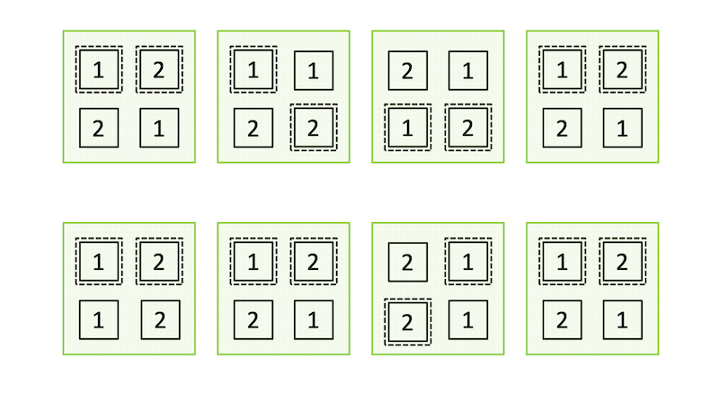

-   Notation

    -   $i = 1, 2$: plant types
    -   $j = 1, 2$: fences (yes, no)
    -   $k = 1, 2$ : chemicals (yes, no)
    -   $l = 1, \ldots, 8$: fields

-   Model $$
    y_{ijkl} = \mu_{ijk} + f_l + s_{ijl} + e_{ijkl}
    $$ where $f_l \sim N(0, \sigma_f^2)$, $s_{ijl} \sim N(0, \sigma_s^2)$, $e_{ijkl} \sim N(0, \sigma_e^2)$.

-   ANOVA Table

    | Source                                                                                                                                                 | DF  |                   EMS                    |
    |----------------------------------|-----------------|:--------------------:|
    | field                                                                                                                                                  | 7   | $8\sigma_f^2 + 2\sigma_s^2 + \sigma_e^2$ |
    | type                                                                                                                                                   | 1   |                                          |
    | fence                                                                                                                                                  | 1   |                                          |
    | ptype$\times$fence                                                                                                                                     | 1   |                                          |
    | field$\times$ptype+field$\times$fence+field$\times$ptype$\times$fence (whole plot error)                                                               | 21  |        $2\sigma_s^2 + \sigma_e^2$        |
    | chem                                                                                                                                                   | 1   |                                          |
    | ptype$\times$chem                                                                                                                                      | 1   |                                          |
    | fence$\times$chem                                                                                                                                      | 1   |                                          |
    | ptype$\times$fence$\times$chem                                                                                                                         | 1   |                                          |
    | error = field$\times$chem+field$\times$ptype$\times$chem+field$\times$fence$\times$chem+field$\times$ptype$\times$fence$\times$chem (split-plot error) | 28  |               $\sigma_e^2$               |
    | c.total                                                                                                                                                | 63  |                                          |

-   SAS Code

    ``` sas
    proc mixed;
      class field ptype fence chem;
      model y=ptype|fence|chem/ddfm=satterth;random field field*ptype*fence;
    run;
    ```

> Comment:
>
> 1.  If a term like `pot(tray)` is specified, it should be the case that pots within each tray are replicates that are not treated differently within a tray
> 2.  For example, `pot(tray)` is correct for Example 3 but not for Example 2
> 3.  When levels of a factor B are different for each level of a factor A, we say that B is nested within A. In SAS, this is indicated by `B(A)`. If C is nested within B, and B is nested within A, this is indicated by `C(A B)` in SAS. See `nesting.sas` for an example

## 19. Maximum Likelihood Estimation for the General Linear Model

-   **Likelihood function**: $L(\theta\mid y) = f(y\mid \theta)$ is a real-valued function of $\theta$ for a given value of $y$.

-   **Maximum likelihood estimatior**: $\hat\theta = \arg\max_{\theta} L(\theta\mid y)$

-   **Score function**: $\frac{\partial \ell(\theta\mid y)}{\partial \theta}$

-   **Score equation**: $\frac{\partial \ell(\theta\mid y)}{\partial \theta} = 0$

    -   Example: $$
        \begin{bmatrix} \hat\beta \\ n^{-1}(y-X\hat\beta)'(y-X\hat\beta)\end{bmatrix} \text{ is an MLE of }\theta = \begin{bmatrix} \beta \\ \theta \end{bmatrix}
        $$ However, the MLE of $\sigma^2$ is not an unbiased estimator, $E(SSE/n) = \frac{n-r}{n}\sigma^2$

-   **Profiled Log Likelihood**: example $\ell^*(\gamma\mid y) = \ell(\begin{bmatrix} \hat\beta_{\Sigma} \\\ \gamma \end{bmatrix} \mid y)$ where we suppose $y = X\beta + \epsilon$, $\epsilon \sim N(0, \Sigma)$, $\Sigma = \sigma^2\begin{bmatrix} 1 & \rho & \rho^2 \\ \rho & 1 & \rho \\\ \rho^2 & rho & 1 \end{bmatrix}$, $\gamma = \begin{bmatrix} \sigma^2 \\ \rho \end{bmatrix}$, $\sigma^2 > 0$, and $\rho \in (-1, 1)$.

    > We can use numerical methods to find $\hat\gamma$ , a maximizer of $\ell^*(\gamma\mid y)$.

##### Example {.unnumbered}

Researchers were interested in comparing the dry weight of maize seedlings from two different genotypes. For each genotype, nine seeds were planted in each of four trays. The eight trays in total were randomly positioned in a growth chamber. Three weeks after the emergence of the first seedling, emerged seedlings were harvested from each tray and individually weighed after drying to obtain one dry weight for each seedling. Although nine seeds were planted in each tray, fewer than nine seedlings emerged in many of the trays.

|                      |                      |
|----------------------|----------------------|
| 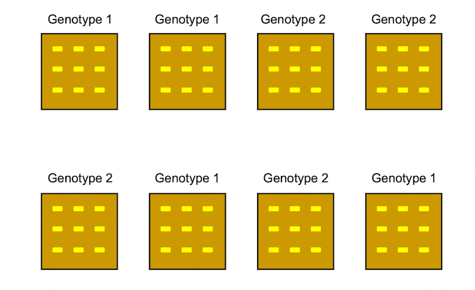 | 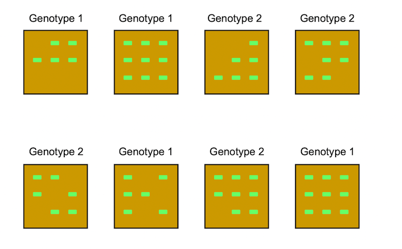 |

Let $y_{ijk}$ be the dry weight of the $k$th seedling in the $j$th tray for genotype $i$. Suppose $$
y_{ijk} = \mu_i + t_{ij} + e_{ijk}
$$ where $\mu_1$ and $\mu_2$ are unknown constants, $t_{ij} \sim N(0, \sigma_t^2)$, $e_{ijk} \sim N(0, \sigma_e^2)$, and all random terms are independent.

```{{r}}
library(nlme)
lme(SeedlingWeight ̃Genotype,random= ̃1|Tray,method="ML", data=d)

Linear mixed-effects model fit by maximum likelihood
  Data: d
  Log-likelihood: -126.3709   # l(thetahat|y)
  Fixed: SeedlingWeight  ̃ Genotype 
(Intercept)   Genotype2
  15.301832   -3.567017
Random effects:
 Formula:  ̃1 | Tray
        (Intercept) Residual
StdDev:    2.932294  1.88247     # sigma_that, sigma_ehat
Number of Observations: 56
Number of Groups: 8


library(lme4)
lmer(SeedlingWeight ̃Genotype+(1|Tray),REML=F,data=d)

Linear mixed model fit by maximum likelihood [’lmerMod’]
Formula: SeedlingWeight  ̃ Genotype + (1 | Tray)
   Data: d
      AIC       BIC    logLik  deviance 
 260.7418  268.8432 -126.3709  252.7418
Random effects:
 Groups   Name        Std.Dev.
 Tray   (Intercept)   2.932
 Residual             1.882
Number of obs: 56, groups: Tray, 8
Fixed Effects:
(Intercept)    Genotype2
     15.302       -3.567
```

## 20. REML Estimation of Variance Components

Consider the GLM: $$
y = X\beta + \epsilon, \text{ where } \epsilon \sim N(0, \Sigma)
$$ and $\Sigma$ is an $n\times n$ positive definite variance matrix which depends on an unknown parameter vector $\gamma$.

**Residual/Restricted Maximum Likelihood (REML)**: an approach that produces unbiased estimators for these special cases and produces less biased estimates than ML in general.

##### REML Method {.unnumbered}

1.  Find $n - \text{rank}(X) = n - r$ linearly independent vectors $a_1, \ldots, a_{n-r}$ such that $a_i'X = 0'$ for all $i = 1, \ldots, n-r$.

2.  Find the MLE of $\gamma$ using $w_1 \equiv a_1'y, \ldots, w_{n-r} \equiv a_{n-r}'y$ as data. $$
    A = [a_1, \ldots, a_{n-r}] \quad w = \begin{bmatrix} w_1 \\ \vdots \\ w_{n-r}  \end{bmatrix} = \begin{bmatrix} a_1'y \\ \vdots \\ a_{n-r}'y  \end{bmatrix} = A'y
    $$

    -   If $a'X = 0'$, $a'y$ is known as **error contrast**. Thus, $w_1, \ldots, w_{n-r}$ comprise a set of $n-r$ error constrasts

    -   There exist $n-r$ linearly independent rows of $I - P_X$ to get $a_1, \ldots, a_{n-r}$.

    -   The error constrasts $w_1, \ldots, w_{n-r}$ will be a subset of the elements of the residual vector $(I-P_X)y = y - \hat y$

Note that $w = A'y = A'\epsilon \sim N(0, A'\Sigma A)$ and the distribution of $w$ depends only on $\gamma$.

The log likelihood function in this case is $$
\ell(\gamma\mid w) = -\frac{1}{2}\log |A'\Sigma A| - \frac{1}{2}w'(A'\Sigma A)^{-1}w - \frac{n-r}{2}\log(2\pi)
$$

## 21. BLUP of Random Effects in Normal Linear Mixed Effects Model

Consider a linear mixed-effects model $$
y = X\beta + Zu + \epsilon, \text{ where } \begin{bmatrix} u \\ e \end{bmatrix} \sim N(\begin{bmatrix} 0 \\ 0 \end{bmatrix}, \begin{bmatrix} G & 0 \\ 0 & R \end{bmatrix}).
$$ Given data $y$, what is our best guess for $u$?

In 611, we can show the BLUP of $u$ is $GZ'\Sigma^{-1}(y - X\hat\beta_{\Sigma})$ which can be viewed as an approximation of $E(u\mid y) = GZ'\Sigma^{-1}(y - X\beta)$.

Suppose $$
\begin{bmatrix} w_1 \\ w_2 \end{bmatrix} \sim N(\begin{bmatrix} \mu_1 \\ \mu_2 \end{bmatrix}, \begin{bmatrix} \Sigma_{11} & \Sigma_{12} \\ \Sigma_{21} & \Sigma_{22} \end{bmatrix}),
$$ the conditional distribution of $w_2$ given $w_1$ is $\left(\mathbf{w}_{2} \mid \mathbf{w}_{1}\right) \sim N\left(\mathbf{\mu}_{2}+\mathbf{\Sigma}_{21} \mathbf{\Sigma}_{11}^{-1}\left(\mathbf{w}_{1}-\mathbf{\mu}_{1}\right), \mathbf{\Sigma}_{22}-\mathbf{\Sigma}_{21} \mathbf{\Sigma}_{11}^{-1} \mathbf{\Sigma}_{12}\right)$.

Based on the model, we have $$
\begin{gathered}
{\left[\begin{array}{l}
\mathbf{y} \\
\mathbf{u}
\end{array}\right] \sim N\left(\left[\begin{array}{c}
\mathbf{X} \mathbf{\beta} \\
\mathbf{0}
\end{array}\right],\left[\begin{array}{cc}
\mathbf{Z} & \mathbf{I} \\
\mathbf{I} & \mathbf{0}
\end{array}\right]\left[\begin{array}{cc}
\mathbf{G} & \mathbf{0} \\
\mathbf{0} & \mathbf{R}
\end{array}\right]\left[\begin{array}{ll}
\mathbf{Z}^{\prime} & \mathbf{I} \\
\mathbf{I} & \mathbf{0}
\end{array}\right]\right)} \\
\stackrel{d}{=} N\left(\left[\begin{array}{c}
\mathbf{X} \mathbf{\beta} \\
\mathbf{0}
\end{array}\right],\left[\begin{array}{cc}
\mathbf{Z} \mathbf{G} \mathbf{Z}^{\prime}+\mathbf{R} & \mathbf{Z} \mathbf{G} \\
\mathbf{G} \mathbf{Z}^{\prime} & \mathbf{G}
\end{array}\right]\right) .
\end{gathered}
$$ Therefore, $E(u\mid y) = GZ'\Sigma^{-1}(y - X\beta)$. To get the BLUP of $u$, we replace $\beta$ by $\hat\beta_{\Sigma} = X(X'\Sigma^{-1}X)^-X'\Sigma^{-1}y$.

For a usual case in which $G$ and $\Sigma = ZGZ' + R$ are unknown, we replace the matrices by estimates and approximate the BLUP of $u$ by $\hat GZ'\hat\Sigma^{-1}(y - X\hat\beta_{\Sigma})$. This approximation to the BLUP is called EBLUP.

## 22. Additional Topics Related to Likelihood

-   **Akaike's Information Criteria**: $AIC = -2\ell(\hat\theta) + 2k$.

-   **Schwarz's Bayesian Information Criterion**: $BIC = -2\ell(\hat\theta) + k\ln n$

    > If REML likelihoods are used, compared models must have the same model for the response mean. Different models for the mean would yield different error contrasts and different datasets for computation of maximized REML likelihoods.

-   **Asymptotic normality of** $\hat\theta$: for sufficiently large $n$, $\hat\theta \stackrel{\cdot}{\sim} N(\theta, I^{-1}(\theta))$ where $I(\theta) = \left[-E\{\frac{\partial^2 \ell(\theta)}{\partial \theta_i \partial \theta_j} \} \right]$ is called **Fisher Information matrix**.

    -   This implies $(\hat\theta - \theta)'[\widehat{Var}(\hat\theta)]^{-1}(\hat\theta - \theta) \stackrel{\cdot}{\sim}(\hat\theta - \theta) \stackrel{d}{\rightarrow} z'z \sim \chi_k^2$.

-   **Wald Tests**: Suppose for large $n$ that $\hat\theta \stackrel{\cdot}{\sim} N(\theta, \widehat{Var}(\hat\theta))$, then a confidence interval for $c'\theta$ that has confidence level approximately equal to $1 - \alpha$ is $c'\hat\theta \pm z_{1-\alpha/2}\sqrt{c'\widehat{Var}(\hat\theta)c}$. Likewise, if $C$ is a $q \times k$ matrix of rank $q$, a test of $H_0: C\theta = d$ can be based on the test statistic $$
    (C\hat\theta - d)'[C\widehat{Var}(\hat\theta)C']^{-1}(C\hat\theta - d) \sim \chi_q^2
    $$

-   **Multivarite Delta Method**: Suppose a $g$ is a function from $R^k$ to $R^m$, i.e. $g = [g_1(\theta), \ldots, g_m(\theta)]'$. Let $D \equiv \frac{\partial g}{\partial \theta}$ be the derivative matrix. By Taylor's theorem, $g(\hat\theta) \approx g(\theta) + D'(\hat\theta - \theta)$ which implies $E(g(\hat\theta)) \approx g(\theta) + D'E(\hat\theta - \theta) = g(\theta)$ and $Var(g(\hat\theta)) \approx Var[g(\theta) + D'(\hat\theta - \theta)] = D'Var(\hat\theta)D$. Therefore, $g(\hat\theta) \stackrel{\cdot}{\sim} N(g(\theta), D'Var(\hat\theta) D)$.

-   **Likelihood Ratio**: Define $\Lambda$ as $\frac{\text{Reduced Model Maximial likelihood}}{\text{Full Model Maximized Likelihood}}$. $-2\ln(\Lambda)$ is known as the likelihood ratio test statisti and $-2\ln(\Lambda) \sim \chi_{k_f - k_r}^2$ under the null hypothesis.

-   **Profile Likelihood Confidence**: $\{\theta_1: \ell(\theta_1, \hat\theta_2(\theta_1)) \geq \ell(\hat\theta) - \frac{1}{2} \chi_{k_1, 1-\alpha}^2\}$. 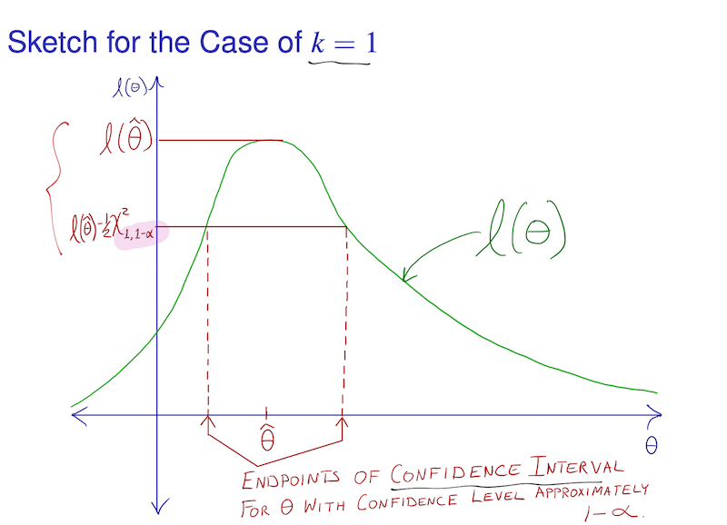

## 23. Repeated Measures

In an exercise therapy study, subjects were assigned to one of three weightlifting programs

-   $i=1$: The number of repetitions of weightlifting was increased as subjects became stronger.
-   $i=2$: The amount of weight was increased as subjects became stronger.
-   $i=3$: Subjects did not participate in weightlifting.
-   Measurements of strength ($y$) were taken on days 2, 4, 6, 8, 10, 12, and 14 for each subject.

Let $y_{ijk}$ be the strength measurement for program $i$, subject $j$, and time point $k$. Suppose $$
y_{ijk} = \mu + \alpha_i + s_{ij} + \tau_k + \gamma_{ik} + e_{ijk}
$$ where $i = 1, 2, 3$, $k = 1,\ldots, 7$, $s_{ij} \sim N(0, \sigma_s^2$), $e_{ijk} \sim N(0, \sigma_e^2)$. $E(y_{ijk}) = \mu + \alpha_i + \tau_k + \gamma_{ik}$ and $Var(y_{ijk}) = \sigma_s^2 + \sigma_e^2$. The covariance between any two different observations from the same subject is $cov(y_{ijk}, y_{ijl}) = Var(s_{ij}) = \sigma_s^2$.

For the set of observations taken on a single subject, we have $var(\mathbf{y}_{ij}) = \sigma_e^2I_{7\times 7} + \sigma_s^2 11'_{7\times 7}$. This is known as **compound symmetric** covariance structure.

Using $n_i$ to denote the number of subjects in the $i$th program, we can write this model in the form $$
y = X\beta + Zu + e
$$ Let $y_{ij} = [y_{ij1}, \ldots, y_{ij7}]'$ and $e_{ij} = [e_{ij1}, \ldots, e_{ij7}]'$ for all $i$ and $j$. In this case, $G = Var(u) = \sigma_s^2 I_{n.\times n.}$, $R = Var(e) = \sigma_e^2 I_{(7n.) \times (7n.)}$, $\Sigma = ZGZ' + R$ is a block diagional matrix with one block of the form $\sigma_e^2I_{7\times 7} + \sigma_s^2 11'_{7\times 7}$ for each subject.

## 24. R Code for the Repeated Measures

```{r}
#Read the data
d=read.delim("http://dnett.github.io/S510/RepeatedMeasures.txt")

#Create Factors
d$Program=as.factor(d$Program)
d$Subj=as.factor(d$Subj)
d$Timef=as.factor(d$Time)

#Load the nlme package
library(nlme)

# compound symmetry
lme(Strength ~ Program * Timef, data = d,random = ~1|Subj)

gls(Strength ~ Program * Timef, data = d,
    correlation = corCompSymm(form = ~1|Subj))
    
# AR(1)
gls(Strength ~ Program * Timef, data = d,
    correlation = corAR1(form = ~1|Subj))
    
# general structure
gls(Strength ~ Program * Timef, data = d,
    correlation = corSymm(form = ~1|Subj),
    weight = varIdent(form = ~1|Timef))

```

## 25. SAS Code for the Repeated Measures

```{{SAS}}
/* Compound Structure */ 
proc mixed;
	class program subj time;
	model strength = program time program * time;
	random subj(program) ;
run;

/* alternative code for compound structure */
proc mixed;
	class program subj time;
	model strength program time program * time;
	repeated time / subject = subj type = cs;   /* cs */
run; 
 
/* AR(1)  */
proc mixed;
	class program subj time;
	model strength program time program * time;
	repeated time / subject = subj type = ar(1);  
run; 

/* General Positive Definite Structure */
proc mixed;
	class program subj time;
	model strength program time program * time;
	repeated time / subject = subj type = un;
run; 
```

AIC and BIC for repeated measures in SAS:

-   $AIC = -2\ell(\hat\theta) + 2k$
-   $BIC = -2\ell(\hat\theta) + k\ln(n)$
-   k = number of variance parameters
-   n = total number of independent subjects

## 26. A Generalized Linear Model for Bernoulli Response Data

Example: for each $i = 1, \ldots, n$, $y_i \sim \text{Bernoulli}(\pi_i)$, $\pi = \frac{\exp(x_i'\beta)}{1 + \exp(x_i'\beta)}$ and $y_1, \ldots, y_n$ are independent. This model is called a **logistic regression model**.

The function $g(\pi) = \log(\frac{\pi}{1-\pi})$ is called *logit function*. $\log(\frac{\pi}{1-\pi})$ is called *log(odds)*.

Note that $g(\pi) = x_i'\beta$. In GLM terminology, the logit is called the *link function*. However, for GLMs, it is not necessary that the mean of $y_i$ be a linear function of $\beta$. Here are some other link functions for logistic regression:

-   probit: $\Phi^{-1}(\pi) = x'\beta$
-   complementary log-log (cloglog in R): $\log(-\log(1-\pi)) = x'\beta$

For GLMs, **Fisher's Scoring Method** is typically used to obtain an MLE for $\beta$, denote as $\hat\beta$. Fisher's Scoring Method is a variation of the *Newton-Raphson algorithm* in which the Hessianm atrix (matrix of second partial derivatives) is replaced by its expected value (-Fisher Information matrix).

For sufficiently large samples, $\hat\beta$ is approximately normal with mean $\beta$ and a variance-covariance matrix that can be approximated by the estimated inverse of the Fisher information matrix, i.e. $\hat\beta \sim N(\beta, I^{-1}(\beta))$.

The **Odds ratio**: $\frac{\tilde{\pi}}{1-\tilde{\pi}}/\frac{\pi}{1-\pi} = \exp(\beta_j)$. This can be explained as: A one unit increase in the jth explanatory variable (with all other explanatory variables held constant) is associated with a multiplicative change in the odds of success by the factor $\exp(\beta_j)$.

If $(L_j, U_j)$ is a $100(1-\alpha)\%$ confidence interval for $\beta_j$. then $(\exp(L_j), \exp(U_j))$ is a $100(1-\alpha)\%$ confidence interval for $\exp(\beta_j)$. Also, a $100(1-\alpha)\%$ CI for $\pi$ is $\left(\frac{1}{1+\exp(-L_j)},\frac{1}{1+\exp(-U_j)}\right)$.

## 27. A Generalized Linear Model for Binomial Response Data

For all $i = 1, \ldots, n$, $y_i\sim \text{Binomial}(m_i, \pi_i)$, where $m_i$ is known number of trials for observation $i$, $\pi_i = \frac{\exp(x_i'\beta)}{1+\exp(x_i'\beta)}$, and $y_1, \ldots, y_n$ are independent. The Binomial log likelihood is $$
\ell(\beta\mid y) = \sum_{i = 1}^n [y_ix_i'\beta - m_i\log(1 + \exp(-x_i'\beta))] + \text{constant}
$$ We can compare the fit of a logitstic regression model known as **saturated model**. The MLE of $\pi_i$ under the logistic regression model is $\hat\pi_i = \frac{\exp(x_i'\hat\beta)}{1 + \exp(x_i'\hat\beta)}$, and the MLE of $\pi_i$ under saturated model is $y_i/m_i$. Then the *likelihood ratio statistic* for testing the logistic regression model as the reduced model VS. the saturated model as the full model is $$
2 \sum_{i=1}^{n}\left[y_{i} \log \left(\frac{y_{i} / m_{i}}{\hat{\pi}_{i}}\right)+\left(m_{i}-y_{i}\right) \log \left(\frac{1-y_{i} / m_{i}}{1-\hat{\pi}_{i}}\right)\right]
$$ which is called the **Deviance Statistics**, the **Residual Deviance** or just the **Deviance**.

**A Lack-of-fit Test**: when $n$ is large, and/or $m_1, \ldots m_n$, are each suitablely large, the Deviance Statistic is approximately $\chi_{n-p}^2$ if the logistic regression model is correct.

**Deviance Residual**: $$
d_{i} \equiv \operatorname{sign}\left(y_{i} / m_{i}-\hat{\pi}_{i}\right) \sqrt{2\left[y_{i} \log \left(\frac{y_{i}}{m_{i} \hat{\pi}_{i}}\right)+\left(m_{i}-y_{i}\right) \log \left(\frac{m_{i}-y_{i}}{m_{i}-m_{i} \hat{\pi}_{i}}\right)\right]}
$$ The residual deviance statistic is the sum of the squared deviance residuals $(\sum_{i = 1}^n d_i^2)$.

**Pearson's Chi-Square Statistic**: Another lack of fit statistic that is approximately $\chi_{n-p}^2$ under the null is Pearson's Chi-Square Statistic: $$
\begin{aligned}
X^{2} = \sum_{i=1}^{n}\left(\frac{y_{i}-\widehat{E}\left(y_{i}\right)}{\sqrt{\widehat{\operatorname{Var}}\left(y_{i}\right)}}\right)^{2} = \sum_{i=1}^{n}\left(\frac{y_{i}-m_{i} \hat{\pi}_{i}}{\sqrt{m_{i} \hat{\pi}_{i}\left(1-\hat{\pi}_{i}\right)}}\right)^{2} .
\end{aligned}
$$ The term $r_i = \frac{y_{i}-m_{i} \hat{\pi}_{i}}{\sqrt{m_{i} \hat{\pi}_{i}\left(1-\hat{\pi}_{i}\right)}}$ is known as *Pearson residual*.

**Residual Diagnostics**: For large $m_i$ values, both $d_i$ and $r_i$ should be approximately distributed as <u>standard normal random</u> <u>variables</u> if the logistic regression model is correct.

```{{r}}
o=g1m(cbind(tumor, total-tumor)~dose, 
      family=binomial(link=logit), data=d)
summary(o)
```

**Overdispersion**: in the GLM framework, its often the case that $Var(y_i)$ is the function of $E(y_i)$. That is the case for logistic regression where $Var(y_i) = m_i\pi(1-\pi_i) = m_i\pi_i - (m_i\pi_i)^2/m_i = E(y_i) - [E(y_i)]^2/m_i$. If the variability of our response is greater than we should expect based on our estimates of the mean, we say that there is **overdispersion**.

**Quasi-likelihood Inference**: in the binomial case, we make all the same assumptions as before except that we assume $Var(y_i) = \phi m_i\pi_i(1-\pi_i)$ for some unknown dispersion parameter $\phi > 1$. The dispersion parameter can be estimated by $\hat\phi = \sum_{i=1}^n d_i^2/(n-p)$ or $\hat\phi = \sum_{i=1}^n r_i^2/(n-p)$.

-   The estimated variance of $\hat\beta$ is multiplied by $\hat\phi$.
-   For Wald type inferences, the standard normal null distribution is replaced by $t$ with $n - p$ degrees of freedom.
-   Any test statistic $T$ that was assumed $\chi_q^2$ under $H_0$ is replaced with $T/(q\hat\phi)$ and compared to an $F$ distribution with $q$ and $n-p$ degrees of freedom.

```{{r}}
oq=g1m(cbind(tumor, total-tumor)~dosef, 
       family=quasibinomial(link=logit),data=d)
summary(oq)
```

## 29. A Generalized Linear Model for Poison Response Data

For all $i = 1, \ldots, n$, $y_i \sim \text{Possion}(\lambda_i)$, $\log(\lambda_i) = x_i'\beta$. The Poisson log likelihood is $$
\ell(\beta\mid y) = \sum_{i=1}^n \left[y_ix_i'\beta - exp(x_i'\beta) - \log(y_i!) \right]
$$ The $\ell(\beta\mid y)$ can be maximized using *Fisher's scoring method* to obtain the MLE.

Let $\lambda = \exp(x'\beta)$ and $\tilde{\lambda} = exp(\tilde{x}'\beta)$ where $\tilde{x} = [x_1, \ldots, x_{j-1}, x_{j} + 1, x_{j+1}, \ldots, x_p ]'$, we have $\tilde{\lambda}/\lambda = \exp(\beta_j)$. This means that all other explanatory variables held constant, the mean response at $x_j + 1$ is $\exp(\beta_j)$ times the mean response at $x_j$.

```{{r}}
o = glm(y ~ x, family = poisson(link = "log"))
summary(o) 

# likelihood ratio test 
anova(o, test = "Chisq")
```

**Lack of Fit**: Under saturated model, $\lambda_i = y_i$. Then the likelihood ratio statistic for testing the Poisson GLM as the reduced model vs. the saturated model as the full model is $$
2 \sum_{i = 1}^n \left[y_i\log\left(\frac{y_i}{\hat\lambda_i}\right) - (y_i - \hat\lambda_i)   \right]
$$

## 29. Generalized Linear Mixef-Effects Model

Example: Consider the experiment designed to evaluate the effectiveness of an anti-fungal chemical on plants. A total of 60 plant leaves were randomly assigned to treatment with 0, 5, 10, 15, 20, or 25 units of the anti-fungal chemical, with 10 plant leaves for each amount of anti-fungal chemical. All leaves were infected with a fungus. Following a two-week period, the leaves were studied under a microscope, and the number of infected cells was counted and recorded for each leaf.

Let $\ell_i \sim N(0, \sigma_\ell^2)$ denote a random effect for the $i$th leaf. Suppose $\log(\lambda_i) = \beta_0 + \beta_1x_i + \ell_i$ and $y_i\mid \lambda_i \sim \text{Poisson}(\lambda_i)$. Finally, suppose $\ell_1, \ldots, \ell_n$ are independent and that $y_1, \ldots, y_n$ are conditionally independent given $\lambda_1, \ldots, \lambda_n$.

**Lognormal distribution**: if $\log(v) \sim N(\mu, \sigma^2 )$, then $v$ is said to have a lognormal distribution. The mean and variance of a lognormal distribution are $E(v) = \exp(\mu + \sigma^2/2)$, $Var(v) = \exp(2\mu + 2\sigma^2) - \exp(2\mu + \sigma^2)$.

Suppose $\log(v) \sim N(\mu, \sigma^2)$ and $u\mid v \sim \text{Poisson}(v)$. Then $E(u) = E(v) = \exp(\mu + \sigma^2/2)$, $$
\begin{aligned}
\operatorname{Var}(u) &=E(\operatorname{Var}(u \mid v))+\operatorname{Var}(E(u \mid v))=E(v)+\operatorname{Var}(v) \\
&=\exp \left(\mu+\sigma^{2} / 2\right)+\exp \left(2 \mu+2 \sigma^{2}\right)-\exp \left(2 \mu+\sigma^{2}\right) \\
&=\exp \left(\mu+\sigma^{2} / 2\right)+\left(\exp \left(\sigma^{2}\right)-1\right) \exp \left(2 \mu+\sigma^{2}\right) \\
&=E(u)+\left(\exp \left(\sigma^{2}\right)-1\right)[E(u)]^{2}
\end{aligned}
$$
