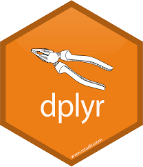
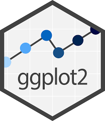
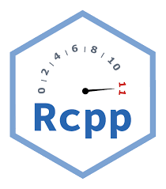
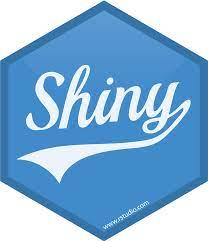
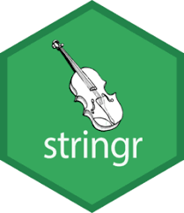
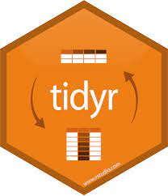

::: {.grid .step .column-page-right}
::: {.g-col-lg-3 .g-col-12}
## R packges

:::

::: {.tool .g-col-lg-9 .g-col-12}

<a href="dplyr.html" role="button" class="btn btn-outline-light">
{width="77" fig-alt="VS Code logo."}dplyr
</a>

<a href="ggplot2.html" role="button" class="btn btn-outline-light">
{width="77" fig-alt="VS Code logo."}ggplot2
</a>

<a href="Rcpp.html" role="button" class="btn btn-outline-light">
{width="77" fig-alt="VS Code logo."}Rcpp
</a>

<a href="Shiny.html" role="button" class="btn btn-outline-light">
{width="77" fig-alt="VS Code logo."}Shiny
</a>

<a href="stringr.html" role="button" class="btn btn-outline-light">
{width="77" fig-alt="VS Code logo."}stringr
</a>

<a href="tidyr.html" role="button" class="btn btn-outline-light">
{width="77" fig-alt="VS Code logo."}tidyr
</a>

<a href="gtsummary.html" role="button" class="btn btn-outline-light">
{width="77" fig-alt="VS Code logo."}gtsummary
</a>

<a href="rpact.html" role="button" class="btn btn-outline-light">
{width="77" fig-alt="VS Code logo."}rpact
</a>
:::
:::
