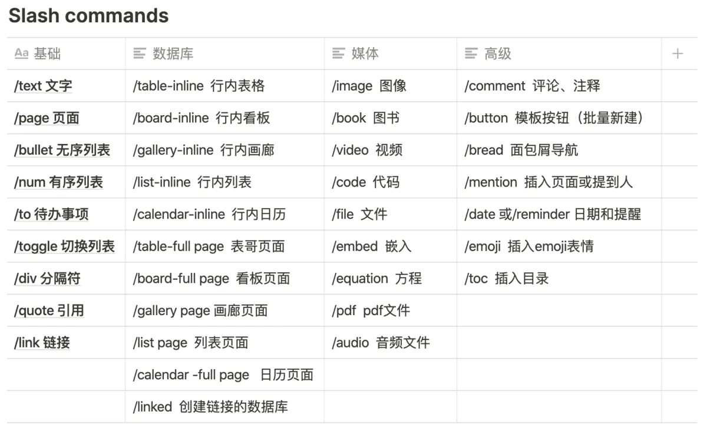

## 窗口页面

-   `cmd + n` 创建新页面（在Mac应用程序中）
-   创建新页面时，`cmd + shift + p` 选择添加页面的位置
-   `cmd + shift + n` 打开一个新窗口（在Mac应用程序中）
-   `cmd + p` 快速跳转到页面（快速查找）
-   `cmd + [`返回上一个页面
-   `cmd + ]` 前进前一个打开的页面
-   `cmd + shift + l` 切换暗模式
-   `cmd + \` 切换侧边栏（在Mac应用程序中）

🎒 **Tip**： 在 `:` 后键入emoji名称，可以在页面中添加emoji表情。 例如： `:apple` 🍎 或是 `:clapping` 👏 。同时按下 `ctrl + cmd + 空格` 可以打开emoji表情库。

-   Refer to a page: method 1: @xxxx; method 2: use `"[[xxxxx]]`"
-   `Fn + left` : go to top page

## Markdown样式转换

在文本块输入过程中，尝试以下快捷方式：

-   `**粗体**` **粗体**
-   `*斜体*` *斜体*
-   `行内代码` `行内代码`
-   `~删除线~` ~~删除线~~

在空文本块的开头，尝试以下快捷方式：

-   输入 `*` `-`或 `+` 后跟 `空格` 以创建无序列表
-   输入 `[]` 以创建Todo事项（ `[]` 之间没有空格）
-   输入 `1.` 后跟 `空格` 创建编号列表
-   输入 `#` 后跟 `空格` 创建一级标题
-   输入 `##` 后跟 `空格` 创建二级标题
-   输入 `###` 后跟 `空格` 创建三级标题
-   输入 `>` 后跟 `空格` 创建展开清单
-   输入 `"` 后跟 `空格` 创建引用内容块

## 内容创建和编辑

-   `回车` 插入文本（新建一个block输入文本）
-   `cmd + shift + m` 创建注释
-   `--` （连续3个 \`\`）创建分隔符
-   选中文本 `cmd + b` 转变成**粗体字**
-   选中文本 `cmd + i` 转变成*斜体字*
-   选中文本 `cmd + u` 添加下划线
-   选中文本 `cmd + shift + s` 应用~~删除线~~
-   选中文本 `cmd + shift + h` 应用上次使用的颜色或高亮显示
-   选中文本 `cmd + k` 添加链接（在输入框中可以使用 `cmd + v` 粘贴链接地址）
-   选中文本 `cmd + e` 创建内联`行内代码`
-   选中文本 `cmd + shift + e` 创建$equation$
-   按下 `Tab` 进行缩进。**注意**：对block内父级文本的缩进，会对所有子级文本生效。 例如：
    -   Block 1 ⬅️ 父级文本 Block 2 ⬅️ 子级文本
-   按下 `shift + Tab` 取消缩进。**注意**：在多行列表（连续的block列表均缩进时）中，取消缩进会使得本行列表内容移至下一行列表内容之后。
-   键入 `/turn` 在block的开头或结尾，将其转换为不同的类型。 注：输入`/turn`后可以直接键入类型名称。 例如： `回电话/turn into checkbox` 创建[待办事项](https://www.notion.so/a1784f070a37400abd31a4e7b5f2e174?pvs=21)
-   在block的开头或结尾键入 `/color` 来改变文本或是高光的颜色。 （若要取消颜色或是高光，键入 `/default`） 例如： `/blue` , `/redbackfround`
-   `cmd + option + 0` 创建文本
-   `cmd + option + 1` 创建1级标题
-   `cmd + option + 2` 创建2级标题
-   `cmd + option + 3` 创建3级标题
-   `cmd + option + 4` 创建待办事项
-   `cmd + option + 5` 创建无序列表
-   `cmd + option + 6` 创建有序列表
-   `cmd + option + 7` 创建切换列表
-   `cmd + option + 8` 创建代码块 (or use `/code`)
-   `cmd + option + 9` 创建页面（或将光标所在行作为页面创建） `cmd` +鼠标点击page，可在一个新窗口中打开page（不使当前页跳转）。
-   `cmd` + `+` 放大页面显示比例
-   `cmd` + `-` 小页面显示比例
-   `cmd + shift + u` 回到上一级页面
-   `cmd + option + t` 可立即打开或关闭页面上的所有切换列表
-   `cmd + option + p` 将block移动到任何页面或数据库
-   使用桌面端Notion时， `cmd` + `l` 会复制当前所在页面的链接。

## 拖拽操作

-   按住 `option` 并选择block，然后按住block前的按钮拖拽，复制到指定位置。

## 编辑和移动blocks（码字过程中）

> 注：Notion中的所有内容均是block（无论是一段文本，或是图片），以下快捷键可以对选中的所有blocks进行编辑。熟练使用可以提高码字效率，几乎可以实现脱离鼠标。\*

-   `esc` 选择光标所在的block，按下键盘上的方向键可以选择其他相邻的blocks。
-   `cmd + a` 全选光标所在的blocks中的内容。
-   选中图片按下 `空格` 全屏显示，再次按下`空格` 取消全屏显示。
-   按住 `shift` + `⬆️、⬇️方向键` ，扩展blocks的选中范围。
-   使用 `cmd` + `shift` + `鼠标点击` ，选中所需的blocks（可以单独选中若干个不相邻的blocks），再次点击可以取消选择。(window `shift + alt + 鼠标点击`)
-   按住 `shift` 并点击，可选中多个连续的blocks。
-   `backspace` 或 `delete` 删除所选的blocks。
-   按下 `Enter` 键，在选中整个block时，进入block内部对文本进行编辑。
-   `cmd` + `d` ，复制并粘贴选中的block。
-   `shift + 回车` 在block内另起一行（block内回车）
-   `cmd` + `/` 激活block的menu按钮菜单，修改选中的（可以是多个）blocks。
    -   使用此快捷键可修改block的类型、颜色，或是对block进行复制、移动。你可以在弹出的menu小窗口中直接键入action或是color。比如：
    -   在board视图中，选中多个卡片，使用 `cmd` + `/` 可以同时进行修改。例如：
-   `cmd` + `shift` + `方向键` 移动选中的blocks。
-   `cmd` + `Enter` ，进入页面 `/page` 、代办事项的完成/未完成之间的切换 `/todo` 、切换列表的展开/隐藏 `/toggle` ，以及嵌入图像的全屏显示切换 `/image` 。

## @指令

-   提到人物，被提到的人将会收到被提及的通知。例如： @马丁爱学习
-   插入页面，输入`@`后，在弹出菜单中选择页面
-   设置日期，键入 `@` + 任意的日期格式（"yesterday," "today" 或 "tomorrow," 甚至是 "next Wednesday"），输入完成后点击日期指令，可以进一步设置提醒等。例如：@Aug 4, 2020 3:00 PM 。
-   添加提醒，键入 `@remind` + 任意的日期格式（including "yesterday," "today," "tomorrow," etc.），例如： `@remind tomorrow 9am`
-   若只想输入\@符号，可在键入\@后按下 `esc`。（在中文输入中，紧跟在中文后的\@符号不会被识别为指令，若要使用\@指令，可以空一格后再键入\@即可。在输入行内代码 "\`"这个上逗号符号同理。）

## `/`斜线指令

注：如果只想输入 `/` 符号，可用 `Esc` 取消斜线指令菜单。

## 其他

-   `cmd + shift + G` 取消同步
