::::: {.grid .step .column-page-right}
::: {.g-col-lg-3 .g-col-12}
## Language

#### Choose the language  and get started {.fw-light}
:::

::: {.tool .g-col-lg-9 .g-col-12}
<a href="R/index.html" role="button" class="btn btn-outline-light"> {width="77" fig-alt="VS Code logo."}R </a>

<a href="R/test2.html" role="button" class="btn btn-outline-light"> 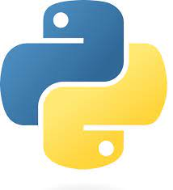{width="77" fig-alt="Jupyter logo."}Python </a>

<a href="hello/rstudio.html" role="button" class="btn btn-outline-light"> {width="77" fig-alt="RStudio logo."}SAS </a>

<a href="hello/rstudio.html" role="button" class="btn btn-outline-light"> 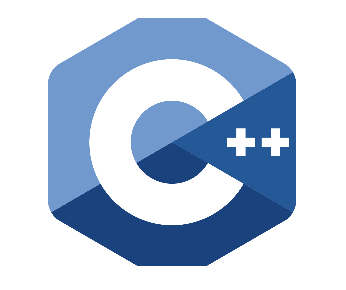{width="77" fig-alt="RStudio logo."}C++ </a>

<a href="hello/rstudio.html" role="button" class="btn btn-outline-light"> 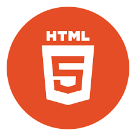{width="77" fig-alt="RStudio logo."}HTML </a>

<a href="hello/rstudio.html" role="button" class="btn btn-outline-light"> 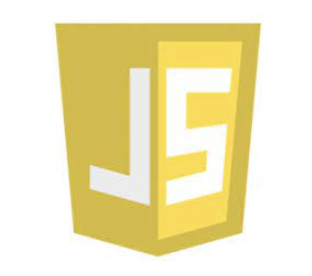{width="77" fig-alt="RStudio logo."}JavaScript </a>

<a href="hello/rstudio.html" role="button" class="btn btn-outline-light"> 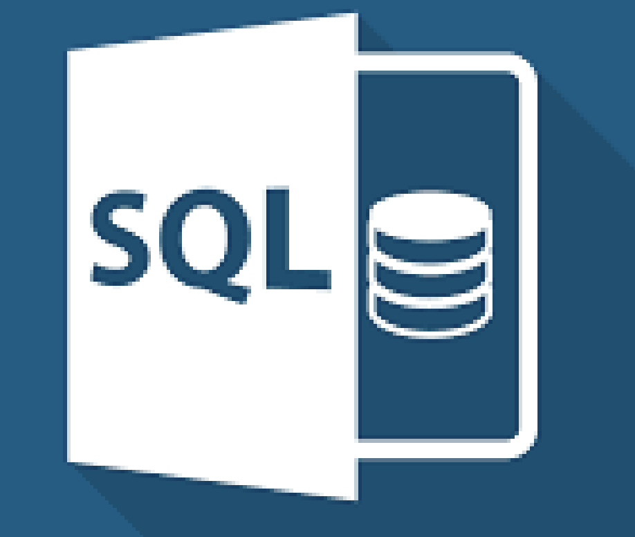{width="77" fig-alt="RStudio logo."}SQL </a>
:::
:::::

::::: {.grid .step .column-page-right}
::: {.g-col-lg-3 .g-col-12}
## Software & System

#### Choose the software/system  and get started {.fw-light}
:::

::: {.tool .g-col-lg-9 .g-col-12}
<a href="Softwares/Rstudio.html" role="button" class="btn btn-outline-light"> 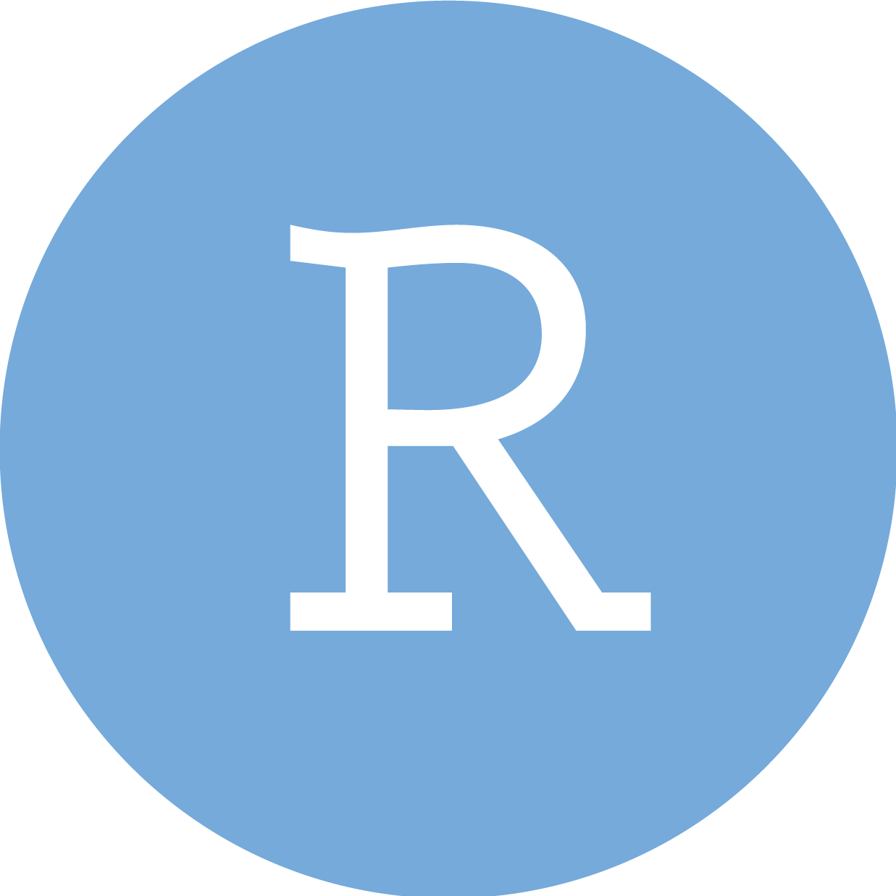{width="77" fig-alt="RStudio logo."}Rstudio </a>

<a href="hello/rstudio.html" role="button" class="btn btn-outline-light"> {width="77" fig-alt="RStudio logo."}Word </a>

<a href="hello/rstudio.html" role="button" class="btn btn-outline-light"> 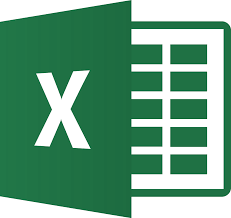{width="77" fig-alt="RStudio logo."}Excel </a>

<a href="hello/rstudio.html" role="button" class="btn btn-outline-light"> 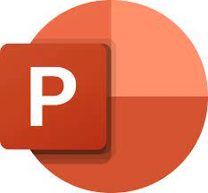{width="77" fig-alt="RStudio logo."}PowerPoint </a>

<a href="hello/rstudio.html" role="button" class="btn btn-outline-light"> 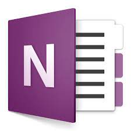{width="77" fig-alt="RStudio logo."}OneNote </a>

<a href="hello/rstudio.html" role="button" class="btn btn-outline-light"> {width="77" fig-alt="RStudio logo."}Jupyter </a>

<a href="hello/rstudio.html" role="button" class="btn btn-outline-light"> 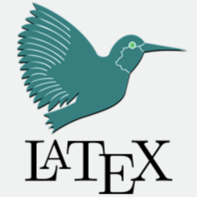{width="77" fig-alt="RStudio logo."}Latex </a>

<a href="hello/rstudio.html" role="button" class="btn btn-outline-light"> {width="77" fig-alt="RStudio logo."}VScode </a>

<a href="Softwares/Notion.html" role="button" class="btn btn-outline-light"> 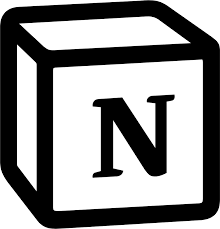{width="77" fig-alt="RStudio logo."}Notion </a>

<a href="Quarto/QuartoBasic.html" role="button" class="btn btn-outline-light"> {width="77" fig-alt="RStudio logo."}Quarto </a>

<a href="hello/rstudio.html" role="button" class="btn btn-outline-light"> 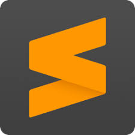{width="77" fig-alt="RStudio logo."}Sublime </a>

<a href="Softwares/MacOS.html" role="button" class="btn btn-outline-light"> {width="77" fig-alt="RStudio logo."}MacOS </a>
:::
:::::

::::: {.grid .step .column-page-right}
::: {.g-col-lg-3 .g-col-12}
## Project

#### Track Large Programming Project {.fw-light}
:::

::: {.tool .g-col-lg-9 .g-col-12}
<a href="Projects/DB_Shiny.html" role="button" class="btn btn-outline-light"> 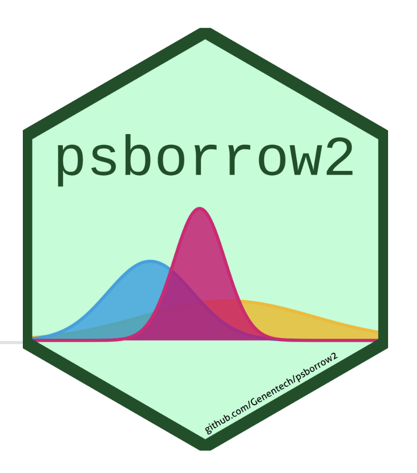{width="77" fig-alt="DB Shiny logo."}Dynamic Borrowing Shiny App </a>
:::
:::::
