::: {.grid .step .column-page-right}

:::

::: {.grid .step .column-page-right}
::: {.g-col-lg-3 .g-col-12}
## Statistical Topics

:::

::: {.tool .g-col-lg-9 .g-col-12}

<a href="topics/Bayesian.html" role="button" class="btn btn-outline-light">
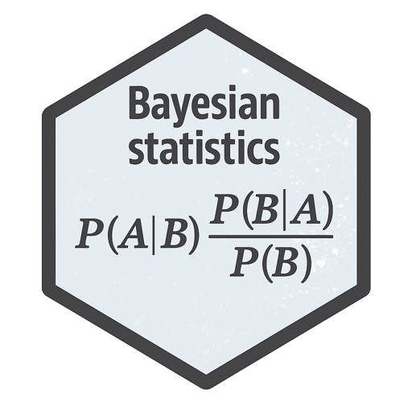{width="77" fig-alt="VS Code logo."}Bayesian Statistics
</a>

<a href="topics/causal-inference.html" role="button" class="btn btn-outline-light">
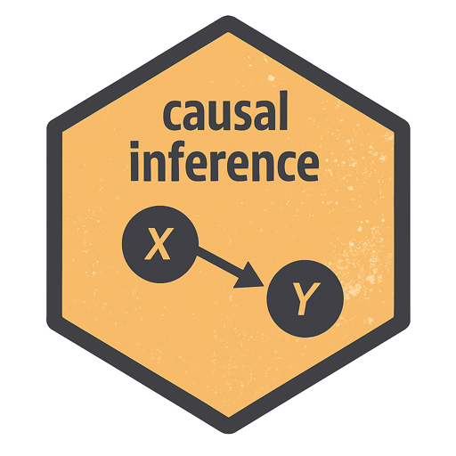{width="77" fig-alt="VS Code logo."}Causal Inference
</a>

<a href="topics/linear-model.html" role="button" class="btn btn-outline-light">
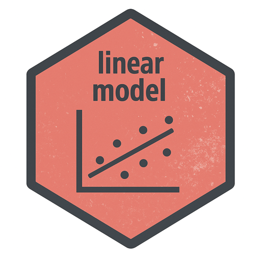{width="77" fig-alt="VS Code logo."}Linear Model
</a>

<a href="topics/machine-learning.html" role="button" class="btn btn-outline-light">
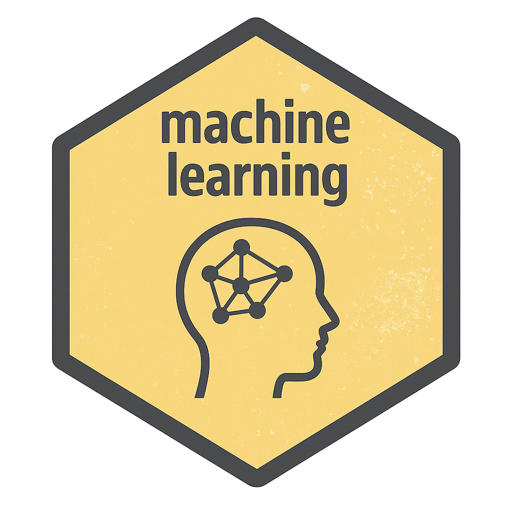{width="77" fig-alt="VS Code logo."}Machine Learning
</a>

<a href="topics/multivaraite-analysis.html" role="button" class="btn btn-outline-light">
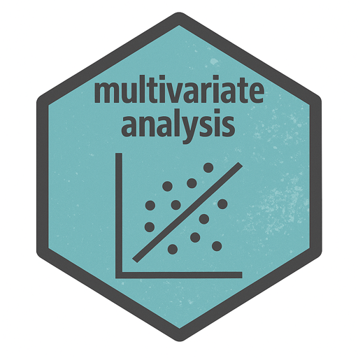{width="77" fig-alt="VS Code logo."}Multivariate Analysis
</a>

<a href="topics/probability-theory.html" role="button" class="btn btn-outline-light">
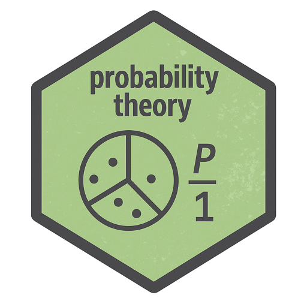{width="77" fig-alt="VS Code logo."}Probability Theory
</a>

<a href="topics/spatial.html" role="button" class="btn btn-outline-light">
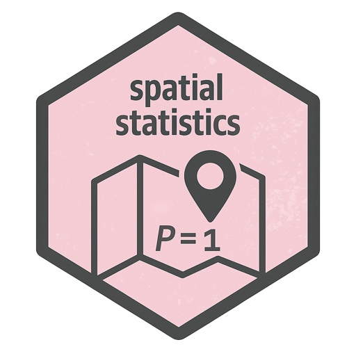{width="77" fig-alt="VS Code logo."}Spatial Statistics
</a>

<a href="topics/survey-sampling.html" role="button" class="btn btn-outline-light">
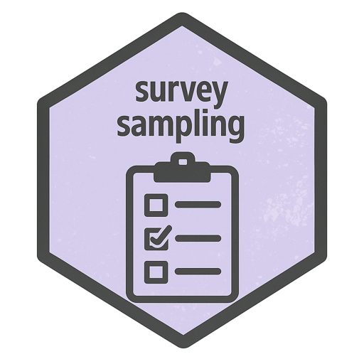{width="77" fig-alt="VS Code logo."}Survey Sampling
</a>

:::
:::

::: {.grid .step .column-page-right}
::: {.g-col-lg-3 .g-col-12}
## Biostatistical Topics

:::

::: {.tool .g-col-lg-9 .g-col-12}
<a href="../biostatistics/topics/dose-finding.html" role="button" class="btn btn-outline-light">
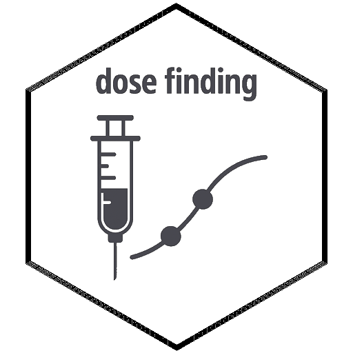{width="77" fig-alt="VS Code logo."}Dose Finding
</a>

<a href="../biostatistics/topics/dose-optimization.html" role="button" class="btn btn-outline-light">
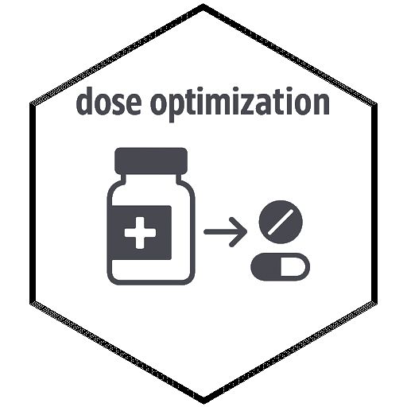{width="77" fig-alt="VS Code logo."}Dose Optimization
</a>

<a href="../biostatistics/topics/dynamic-borrowing.html" role="button" class="btn btn-outline-light">
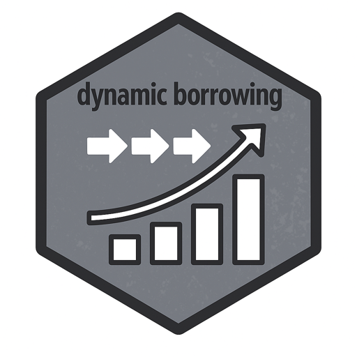{width="77" fig-alt="VS Code logo."}Dynamic Borrowing
</a>

<a href="../biostatistics/topics/hypothesis-testing.html" role="button" class="btn btn-outline-light">
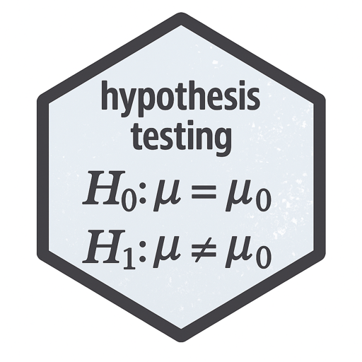{width="77" fig-alt="VS Code logo."}Hypothesis Testing
</a>

<a href="../biostatistics/topics/survival-analysis.html" role="button" class="btn btn-outline-light">
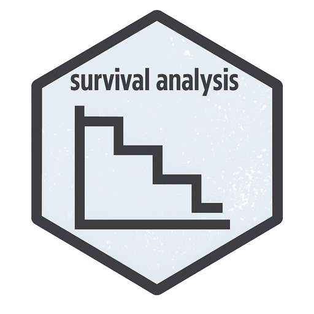{width="77" fig-alt="VS Code logo."}Survival Analysis
</a>

<a href="../biostatistics/topics/decision-making.html" role="button" class="btn btn-outline-light">
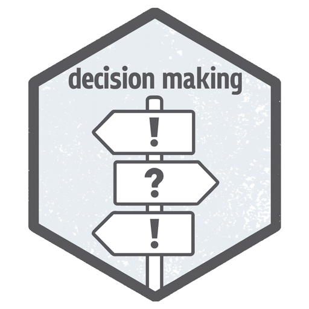{width="77" fig-alt="VS Code logo."}Decision Making
</a>

<a href="../biostatistics/topics/multiple-comparison.html" role="button" class="btn btn-outline-light">
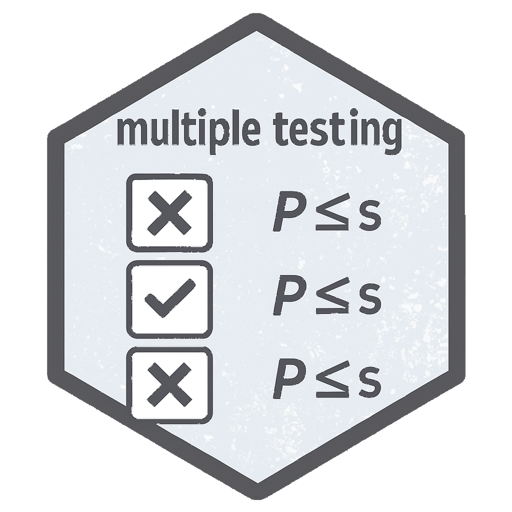{width="77" fig-alt="VS Code logo."}Multiple Comparison
</a>

<a href="../biostatistics/topics/targeted-learning.html" role="button" class="btn btn-outline-light">
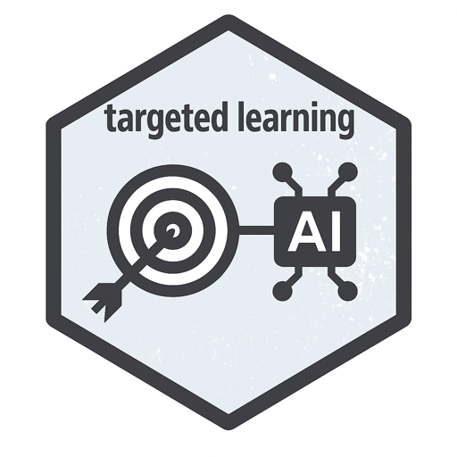{width="77" fig-alt="VS Code logo."}Targeted Learning
</a>

<a href="../biostatistics/topics/estimand.html" role="button" class="btn btn-outline-light">
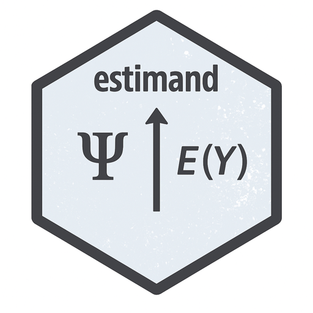{width="77" fig-alt="VS Code logo."}Estimand
</a>
:::

:::
